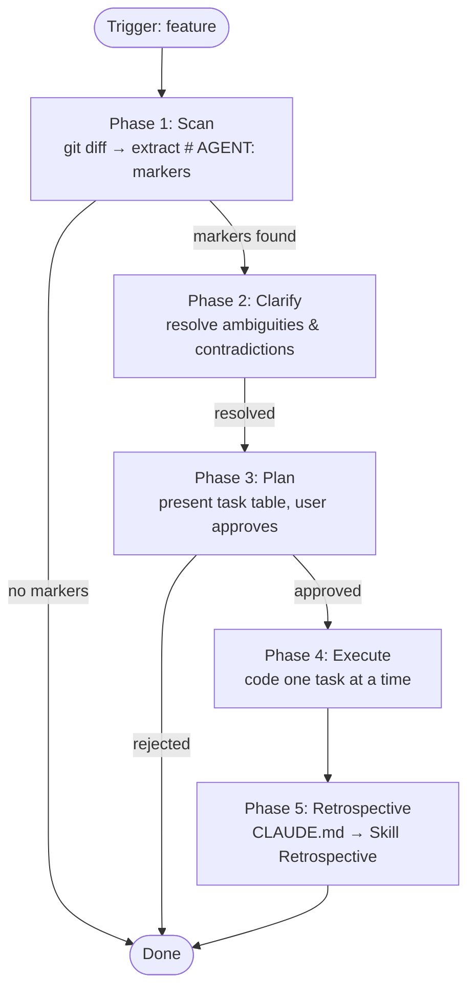

# Developer Feature Flow

## Overview

Coding skill driven by `# AGENT:` comment markers left in Python source code. Scans git diff for markers, extracts their context, clarifies ambiguities, presents a plan for approval, and implements approved tasks one at a time.

Does NOT remove `# AGENT:` comments after implementation — that is the responsibility of the review skill.

## When to use

- The user selects `feature` in the developer dispatcher
- The user has added `# AGENT:` comments to source files and wants them implemented

**DO NOT use when:**
- The user wants to review existing code — use `employees-developer-review`
- There are no `# AGENT:` markers in any available diff (uncommitted or last commit)

## Marker format

### Single-line

```python
# AGENT: Add input validation.
def create_user(name, age):
```

### Multi-line (continuation lines start with `#`)

```python
# AGENT: Add input validation.
# Check that name is not empty, age > 0.
# Raise ValueError on error.
def create_user(name, age):
```

### Placement rules

A `# AGENT:` block is a sequence of lines:
1. First line starts with `# AGENT:`
2. Continuation lines start with `#` (not `# AGENT:`) and follow immediately (no blank line between them)
3. Block ends at the first non-comment line or a blank line within the `#` sequence

Context determined by what follows the block:
- **module-level** — block is before the first `def`/`class` in the file, applies to the entire module
- **entity-level** — block is directly before a `def`/`class` line, applies to that entity
- **inline** — block is inside a function/method body, applies to the nearest enclosing function



## Phase 1: Scan

### Step 1: Collect diff

1. Run `git diff` (unstaged) + `git diff --cached` (staged)
2. If both are empty — ask the user:
   > No uncommitted changes found. Check the last commit?
   > - **Yes** — use `git diff HEAD~1`
   > - **No** — exit
3. Combine all diff output for analysis

### Step 2: Extract markers

From the diff, extract all `# AGENT:` blocks:

1. Scan each diff line for `# AGENT:` (in added lines — lines starting with `+`)
2. For each match, collect continuation lines (consecutive `+` lines starting with `#` that are not `# AGENT:`) until a non-comment line or blank line
3. Strip the leading `+` from diff lines to get the actual source text

### Step 3: Determine context

For each extracted block, determine its context by reading the surrounding lines in the diff:

1. **module-level**: block appears before any `def` or `class` in the file
2. **entity-level**: block appears directly before a `def` or `class` line (within 0-2 lines)
3. **inline**: block appears inside a function body (after the `def` line, before the next `def`/`class` or end of indentation)

If context cannot be determined from the diff alone — read the source file to resolve.

### Step 4: Report

If no markers found — inform the user and exit.

If markers found — proceed to Phase 2.

## Phase 2: Clarify

Analyze extracted markers for problems. Check one issue at a time.

### Ambiguity

Vague instructions without actionable specifics:

| Pattern | Why it's ambiguous | What to ask |
|---------|-------------------|-------------|
| "improve X" | Improve how? Performance? Readability? | "What aspect of X should be improved?" |
| "fix bug" | Which bug? What behavior? | "What is the expected behavior?" |
| "optimize" | Speed? Memory? What metric? | "What should be optimized and to what target?" |
| "refactor" | What's wrong with current code? | "What specific issues in the current code need refactoring?" |

### Contradictions

Two markers on the same entity with conflicting instructions. Ask which takes priority.

### Missing context

References to types, modules, or variables that do not exist in the codebase. Ask the user to clarify what is meant.

### Process

- If issues found — ask the user one question at a time using AskUserQuestion
- If no issues — skip to Phase 3

## Phase 3: Plan

Present the plan as a table:

| # | File | Entity | AGENT prompt | Planned actions |
|---|------|--------|--------------|-----------------|
| 1 | `user.py` | `create_user` | Add input validation | Add checks for name/age, raise ValueError |
| 2 | `order.py` | *(module)* | Add logging | Add logging import, instrument create/delete |

### User actions

Wait for user response. The user can:
- Approve all tasks
- Remove specific tasks
- Edit planned actions for specific tasks
- Reject the entire plan

Only proceed to Phase 4 after explicit approval.

## Phase 4: Execute

Execute approved tasks one at a time, in plan order.

### Compile check configuration

Read `.qarium/ai/employees/developer.md` Config section to get `compile_cmd`. If the file or Config section is missing — inform the user that compile checks are skipped and proceed without them.

The `compile_cmd` contains a `<file>` placeholder — replace it with the actual file path before running. If `compile_cmd` does not contain `<file>`, warn the user and skip compile checks for this session. Quote the file path if it contains spaces.

For each task:

1. Read the target file to understand current code
2. Implement the change
3. Run compile check: execute `compile_cmd` with the changed file path. If compilation fails — show the error, fix it, re-compile
4. Show the `git diff` for the change
5. Mark the task as done in the plan table

Do NOT remove `# AGENT:` comments during execution — they remain for the review skill.

## Common mistakes

| Mistake | Fix |
|---------|-----|
| Scanning all `.py` files instead of diff | Only scan git diff output |
| Treating unrelated `#` comments as AGENT continuation | Only group consecutive `#` lines immediately after `# AGENT:` with no blank line gap |
| Removing `# AGENT:` comments after implementation | Only the review skill removes markers, with user confirmation |
| Executing without plan approval | Always present plan and wait for explicit approval |
| Skipping multi-line AGENT blocks | Always parse continuation `#` lines after `# AGENT:` |
| Implementing multiple tasks at once | Execute one at a time, show diff after each |
| Ignoring context (module/entity/inline) | Always determine context to understand scope |
| Asking all clarification questions at once | One question at a time |
| Skipping compile check after code changes | Always run compile_cmd from developer.md Config after each change |
| Running compile check without reading developer.md | Read compile_cmd from Config, do not hardcode the command |

## Phase 5: Retrospective

After completing all main work, perform the retrospective as defined in CLAUDE.md → Skill Retrospective.