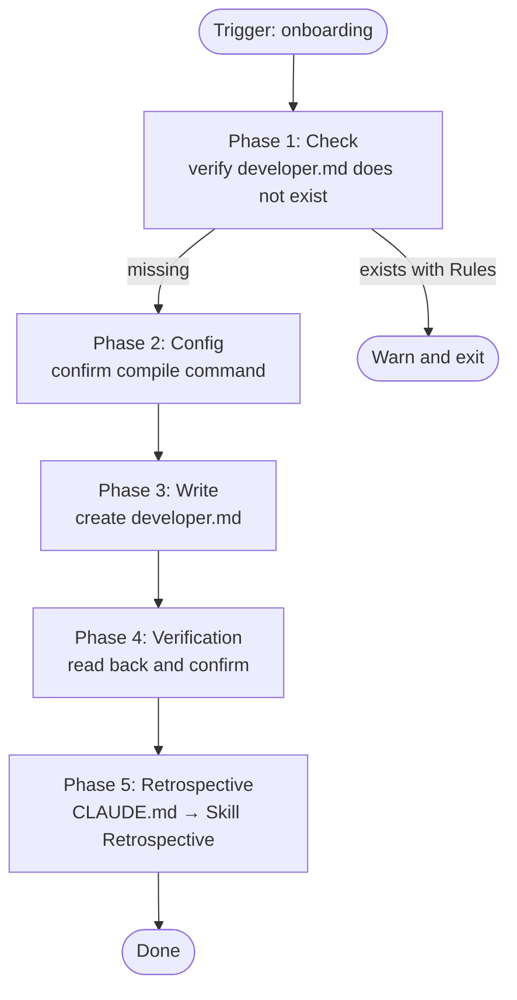

# Developer Onboarding

## Overview

Create `.qarium/ai/employees/developer.md` with coding conventions, compile check configuration, and empty tables for patterns and lessons.

## When to use

- The file `.qarium/ai/employees/developer.md` does not exist
- The file exists but has no `## Rules` section
- The `/qarium:employees:developer` dispatcher automatically routes here when developer.md is missing

**DO NOT use when:**
- `.qarium/ai/employees/developer.md` already has a `## Rules` section — warn the user and suggest using the developer command for feature or review work
- This is not a Python project

## Virtual Environment

Before executing any shell commands (python, py_compile), detect the project's virtual environment:

1. Check for `.venv/` in the project root
2. If not found, check for `venv/`
3. If found → prefix all commands: `source .venv/bin/activate && <command>` (or `source venv/bin/activate && <command>`)
4. If not found → execute `<command>` as-is

This applies to Phase 4 (verification compile check).



## Phase 1: Check

1. Check if `.qarium/ai/employees/developer.md` exists
2. If it exists and contains `## Rules` — warn the user:
   > `.qarium/ai/employees/developer.md` already exists with Rules. Use the developer command for feature or review work.
   Exit.
3. If it does not exist or has no `## Rules` — proceed to Phase 2

## Phase 2: Config

Show the user the compile command configuration:

| Setting     | Default                       |
|-------------|-------------------------------|
| compile_cmd | `python -m py_compile <file>` |

Ask the user to confirm or customize. The `<file>` placeholder will be replaced with the actual file path when the command runs.

If a virtual environment was detected (see Virtual Environment section), remind the user that compile commands will be prefixed with venv activation automatically.

## Phase 3: Write developer.md

Create `.qarium/ai/employees/developer.md`. All file content is written in English.

**If the file exists and contains `## Rules`** — DO NOT overwrite. Warn the user and exit.

**If the file does not exist or has no `## Rules`** — create/update.

### Generation template

````markdown
# Developer

## Config

| Setting     | Value          |
|-------------|----------------|
| compile_cmd | <from Phase 2> |

## Rules

### Conventions

| Rule | Description |
|------|-------------|
| constants module | Constants-only modules must be imported as a whole (`import constants`) and accessed via `constants.NAME` |
| typed constants | All constants must be typed with `t.Final` or `t.Final[<type>]` |
| typed signatures | All function/method signatures must have type annotations for parameters and return types |
| Python 3.10 compat | Code must run on Python 3.10+ — use `t.Optional[X]` instead of `X | None`, `t.Union` instead of `X | Y` in runtime contexts (dataclass fields, function defaults) |
| typing alias | Use `import typing as t` instead of `from typing import ...` |
| No if/else in logic | Do not use if/else anywhere except module globals |
| No staticmethod classes | Classes with only static methods are modules — use modules instead |
| classmethod constructors | Use classmethod as alternative constructors (initializers) |
| No singleton classes | Singleton class is a module — use modules instead |
| LBYL over EAFP | Look Before You Leap is preferred over Easier to Ask Forgiveness |
| Relative imports | Use relative imports within the package |
| Aggregation over inheritance | Prefer aggregation/composition over inheritance |
| Docstrings in English | All docstrings must be written in English |
| Google-style docstrings | Use Google-style format: `Args:`, `Returns:`, `Raises:` sections with indented descriptions |
| Visual block separation | Separate logical blocks inside functions with a blank line: control flow (`if`, `for`, `while`, `with`, `try`), `return`, `raise`, and groups of related statements |

### Patterns

| Pattern | Description | Example |
|---------|-------------|---------|

## Lessons

| Problem | Why | How to prevent |
|---------|-----|----------------|
````

### Rules

1. Present the generated developer.md to the user for approval before writing.
2. After writing, verify correctness by reading the file back.

## Phase 4: Verification

1. Read `.qarium/ai/employees/developer.md` back
2. Verify all sections exist: Config, Rules (Conventions + Patterns), Lessons
3. Confirm to the user

## Common mistakes

| Mistake | Fix |
|---------|-----|
| Overwriting existing developer.md with Rules | Check first, warn and exit if found |
| Writing developer.md without user approval | Present for review first |
| Skipping the Config section | Config must always be present — feature and review skills read compile_cmd from here |
| Leaving empty Conventions table | Always include the 16 base conventions |
| Forgetting empty Patterns and Lessons tables | Always create them empty — they will be filled during project work |
| Hardcoding compile_cmd without asking | Always show config to user in Phase 2 for confirmation or customization |

## Phase 5: Retrospective

After completing all main work, perform the retrospective as defined in CLAUDE.md → Skill Retrospective.