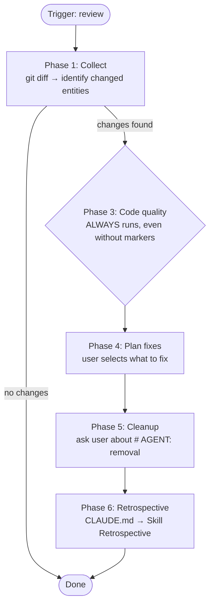

# Developer Review Flow

## Overview

Review skill for code changes. Checks two aspects:

1. **Agent compliance** — whether the code implements what `# AGENT:` markers requested
2. **Code quality** — cyclomatic complexity, redundancy, and consistency with surrounding code

Presents all findings as a fix plan. User selects which to apply. After fixes, optionally removes `# AGENT:` markers.

## When to use

- The user selects `review` in the developer dispatcher
- After the feature skill has implemented `# AGENT:` tasks
- When the user wants to verify code quality of recent changes

**DO NOT use when:**
- The user wants to implement new `# AGENT:` markers — use `employees-developer-feature`
- There are no uncommitted changes to review

## Marker format

Same as feature skill. See `employees-developer-feature` for full format specification.

## Phase 1: Collect

### Step 1: Gather diff

Same as feature skill Phase 1 Step 1. See `employees-developer-feature` for full diff collection procedure.

### Step 2: Expand to enclosing entities

For each changed file:

1. Determine which lines were changed (added/modified) from the diff
2. Read the source file
3. For each changed line, find the enclosing function, class, or method
4. Collect the full text of each enclosing entity (the entire function/class body)
5. Deduplicate — if multiple changes fall in the same entity, include it once

This gives the review scope: the full functions/classes/methods that contain new code, not just the changed lines.

## Phase 2: Agent compliance

For each `# AGENT:` block found in the changed files (from diff or source):

1. Read the AGENT prompt
2. Determine the target entity (module/function/class)
3. Check the current code against what the prompt requested
4. Assign a status:

| Status | Meaning |
|--------|---------|
| **done** | The prompt is fully implemented in the code |
| **partial** | Some aspects are implemented, others are missing |
| **not_done** | The prompt is not implemented at all |

### Present compliance report

| File | Entity | AGENT prompt | Status | Details |
|------|--------|--------------|--------|---------|
| `user.py` | `create_user` | Add input validation | **done** | Checks name and age |
| `order.py` | *(module)* | Add logging | **partial** | Missing delete logging |

Only `done` entries are resolved. `partial` and `not_done` become findings for Phase 4.

## Phase 3: Code quality

Check the expanded entities (from Phase 1 Step 2) for quality issues.

### Convention compliance

Read `.qarium/ai/employees/developer.md` Rules → Conventions section. Check each changed entity for violations of these conventions. If the file or Conventions section is missing — skip this check.

### New code checks

| Check | What to look for | Severity guideline |
|-------|-------------------|-------------------|
| Convention compliance | Code violates rules from developer.md Conventions (e.g., wrong import style, if/else in logic, staticmethod classes) | **warning** or **critical** for structural violations |
| Docstring consistency | Docstrings must be consistent with function signatures (parameter names, types) and actual logic (described behavior matches code behavior) | **warning** or **critical** if logic is misrepresented |
| Cyclomatic complexity | Deep nesting (>3 levels), many branches (>5 if/elif/for/while in one function) | **warning** or **critical** if >5 levels |
| Redundancy | Duplicated logic, copy-pasted code blocks, unnecessary helper functions | **suggestion** or **warning** if significant |
| Dead code | Unused variables, unreachable branches, commented-out code | **suggestion** |

### Old+new consistency checks

| Check | What to look for | Severity guideline |
|-------|-------------------|-------------------|
| Type consistency | New code uses different types than surrounding code (e.g., str vs bytes) | **warning** |
| Naming consistency | Different naming patterns (snake_case vs camelCase, abbreviations) | **warning** |
| Encapsulation | Accessing private attributes (`_attr`) of other classes, breaking abstraction layers | **critical** |
| Unused imports | New imports not used, or old imports made unused by changes | **suggestion** |
| Pattern consistency | Different error handling patterns, different collection types for same purpose | **warning** |

### Present quality report

| File | Entity | Check type | Severity | Description | Suggestion |
|------|--------|------------|----------|-------------|------------|
| `user.py` | `create_user` | complexity | **warning** | 4 levels of nesting | Extract validation into helper |
| `order.py` | `process` | consistency | **critical** | Uses old-style format string | Use f-strings to match surrounding code |

## Phase 4: Plan fixes

Combine findings from Phase 2 (compliance issues with `partial`/`not_done` status) and Phase 3 (quality findings).

Present all findings in a single table:

| # | Source | File | Entity | Severity | Description | Proposed fix |
|---|--------|------|--------|----------|-------------|--------------|
| 1 | compliance | `order.py` | *(module)* | **warning** | Missing delete logging | Add `logger.info` to `delete_order` |
| 2 | quality | `user.py` | `create_user` | **warning** | 4 levels of nesting | Extract validation |
| 3 | quality | `order.py` | `process` | **critical** | Old-style format string | Use f-strings |

### User actions

Wait for user response. The user selects which findings to fix:
- Select specific items by number
- Select all
- Skip specific items

Only approved fixes are applied. Apply them one at a time, show `git diff` after each.

### Compile check after fixes

Same as feature skill Phase 4 compile check. See `employees-developer-feature` for full compile check procedure.

## Phase 5: Cleanup

If no `# AGENT:` markers were found in Phase 2 — skip this phase, proceed directly to Phase 6.

If markers were found — after all approved fixes are applied (or if no fixes were selected), ask the user:

> All `# AGENT:` markers have been processed. Remove them from the code?
> - **Yes, remove all** — delete all `# AGENT:` blocks (multi-line) from all changed files
> - **No, keep them** — leave markers in place

### Removal rules

If user chooses "Yes, remove all":

1. For each changed file (from Phase 1), scan for `# AGENT:` blocks
2. Remove the entire block: the `# AGENT:` line plus all continuation `#` lines
3. Remove resulting blank lines that would leave double-blank-lines
4. Do NOT remove unrelated comments or code

## Common mistakes

Compile check and marker parsing mistakes are shared with the feature skill. See `employees-developer-feature` Common mistakes.

Review-specific mistakes:

| Mistake | Fix |
|---------|-----|
| Reviewing only changed lines instead of enclosing entities | Expand to full function/class in Phase 1 |
| Removing markers without asking | Always ask in Phase 5 Cleanup |
| Removing markers in files not touched by fixes | Only remove from changed files identified in Phase 1 |
| Grouping all findings by severity instead of source | Group by source (compliance vs quality) then by severity |
| Applying fixes without user approval | Present plan, wait for selection |
| Skipping the compliance check when no AGENT markers exist | Still run Phase 3 quality checks |
| Skipping convention compliance check | Always read Conventions from developer.md Rules and check code against them |

## Phase 6: Retrospective

After completing all main work, perform the retrospective as defined in CLAUDE.md → Skill Retrospective.