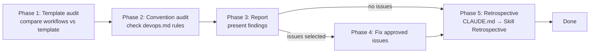

# DevOps Audit

## Overview

Compare CI/CD workflow files against the template and check `.qarium/ai/employees/devops.md` conventions.

## When to use

- The user selects `audit` in the devops dispatcher
- Periodic health check of CI/CD pipelines
- After manual workflow edits

## Template

Uses `.claude/templates/library/src/` as reference.

### DevOps-managed files

| Template file | Project file | What to check |
|---------------|--------------|---------------|
| `{{devops:.github}}/workflows/lint.yml` | `.github/workflows/lint.yml` | Trigger branch, source dir, commands |
| `{{devops:.github}}/workflows/tests.yml` | `.github/workflows/tests.yml` | Trigger branch, Python matrix, test command |
| `{{devops:.github}}/workflows/docs.yml` | `.github/workflows/docs.yml` | Trigger branch, deploy command |
| `{{devops:.github}}/workflows/publish.yml` | `.github/workflows/publish.yml` | Python version, package source dir, PyPI token, release notes model |
| `{{devops:.github}}/workflows/new_version.yml` | `.github/workflows/new_version.yml` | Branch pattern, default branch check, ADMIN_TOKEN secret |
| `{{devops:.github}}/workflows/strictacode.yml` | `.github/workflows/strictacode.yml` | Source dir, thresholds |

### DevOps-owned placeholders

`${DEVOPS_TRIGGER_BRANCH}`, `${DEVOPS_PACKAGE_SNAKE}` (strictacode.yml, publish.yml), `${DEVOPS_LINT_CHECK_ARGS}`, `${DEVOPS_LINT_FORMAT_ARGS}`, `${DEVOPS_PYTHON_MATRIX}`, `${DEVOPS_TEST_CMD}`, `${DEVOPS_DEPLOY_CMD}`, `${DEVOPS_PUBLISH_PYTHON}`, `${DEVOPS_SC_*}`

Any remaining `${DEVOPS_*}` in project files is a finding.

## Phase 1: Template audit

### Read template and project files

1. Read template workflow files from `.claude/templates/library/src/{{devops:.github}}/workflows/`
2. Read project workflow files from `.github/workflows/`
3. Compare each workflow

### Cross-checks per workflow

**pyproject.toml checks:**

| Check | Status on discrepancy |
|-------|----------------------|
| Python matrix in tests.yml vs `requires-python` | **stale** — matrix doesn't cover min version |
| Dependency group in `pip install` vs `[project.optional-dependencies]` | **inaccurate** — group doesn't exist |
| Python version in publish.yml vs `requires-python` | **stale** — below minimum |

**qa.md Config checks:**

| Check | Status on discrepancy |
|-------|----------------------|
| Lint commands in lint.yml vs `lint_cmd`, `format_cmd` | **inaccurate** — commands differ |
| Test command in tests.yml vs `run_tests_cmd` | **inaccurate** — command differs |

**tech-writer.md Config checks:**

| Check | Status on discrepancy |
|-------|----------------------|
| Deploy command in docs.yml vs `deploy_cmd` | **inaccurate** — command differs |

**devops.md checks:**

| Check | Status on discrepancy |
|-------|----------------------|
| Workflow Registry vs actual `.github/workflows/` | **drift** — added or removed workflow |
| `trigger_branch` vs triggers in workflows | **stale** — branches don't match |

**Gap detection:**

| Check | Status |
|-------|--------|
| qa.md with `lint_cmd` + no lint workflow | **missing** |
| qa.md with `run_tests_cmd` + no tests workflow | **missing** |
| tech-writer.md with `build_cmd` + no docs workflow | **missing** |
| No strictacode workflow | **missing** |
| strictacode workflow + no `.strictacode.yml` | **missing** |
| `[tool.ruff]` in pyproject.toml + no lint workflow | **missing** |
| `[tool.pytest.ini_options]` in pyproject.toml + no tests workflow | **missing** |
| `docs` group in `[project.optional-dependencies]` + no docs workflow | **missing** |

### Placeholder check

| Check | Status |
|-------|--------|
| `${DEVOPS_*}` in any workflow | **unresolved** |
| `.github/` still named `{{devops:.github}}` | **unrenamed** |

## Phase 2: Convention audit

Read `.qarium/ai/employees/devops.md`:

| Check | Source | Status |
|-------|--------|--------|
| Workflow Registry matches actual workflows | Compare | **drift** if different |
| `trigger_branch` matches workflow triggers | Compare | **stale** if differs |
| Commands match qa.md/tech-writer.md | Cross-check | **inaccurate** if different |
| Conventions followed in workflows | Scan `.github/workflows/` | **violated** if not |

## Phase 3: Report

Present findings:

| Workflow | Check | Status | Current | Expected | Source |
|----------|-------|--------|---------|----------|--------|
| `tests.yml` | Python matrix | **stale** | `[3.10-3.12]` | `[3.10-3.13]` | pyproject.toml |
| `lint.yml` | `${DEVOPS_PACKAGE_SNAKE}` | **unresolved** | placeholder | actual name | template |
| Registry | coverage | **drift** | missing `security.yml` | add entry | actual files |

## Phase 4: Fix approved issues

The user selects which issues to fix. For each:

1. Read the affected file
2. Apply minimal fix
3. Verify YAML syntax after fix

## Common mistakes

| Mistake | Fix |
|---------|-----|
| Only checking one workflow | Check ALL workflow files |
| Skipping Registry comparison | Always compare Registry with actual files |
| Not cross-checking with qa.md/tech-writer.md | Commands in CI must match role configs |
| Fixing without verifying YAML | Always validate YAML after changes |
| Deleting workflows without confirmation | Always ask before deleting |

## Phase 5: Retrospective

After completing all main work, perform the retrospective as defined in CLAUDE.md → Skill Retrospective.