# DevOps Flow

## Overview

Skill for maintaining the project's CI/CD infrastructure. Manages workflows across four scenarios:

1. **Auto-analysis of changes** (default, no arguments) — analysis of git diff, detection of changes in qa.md, tech-writer.md and pyproject.toml that require CI updates, presentation of a plan for approval.
2. **Explicit user request** (with arguments) — execution of a specific request to modify CI (add a workflow, change matrix, update trigger, etc.).
3. **Audit** (argument `audit`) — cross-check of CI against pyproject.toml, qa.md, tech-writer.md without git diff to find discrepancies.
4. **devops.md synchronization** (always at the end) — updating the Workflow Registry in `.qarium/ai/employees/devops.md` to match the actual state of `.github/workflows/*.yml`.

Reads configuration from `.qarium/ai/employees/devops.md` (Config + Rules), as well as qa.md and tech-writer.md for actual commands used in CI.

## When to use

- After changing project dependencies (pyproject.toml)
- After changing the Python version (requires-python)
- After changing Config in qa.md (lint_cmd, format_cmd, run_tests_cmd)
- After changing Config in tech-writer.md (build_cmd)
- When the user explicitly asks to modify CI configuration
- After directly modifying workflow files
- When the user asks to verify CI for discrepancies with project configuration

```dot
digraph flow {
    rankdir=LR;
    trigger [label="Trigger: /qarium:employees:devops [аргументы]" shape=box];
    mode [label="Mode?" shape=diamond];
    auto [label="Phase 2: Change collection\ngit diff" shape=box];
    has_changes [label="Changes found?" shape=diamond];
    direct [label="Collect changes from arguments" shape=box];
    audit [label="Phase 7: Audit\ncross-check CI with project" shape=box];
    audit_fix [label="User selects fixes" shape=box];
    plan [label="Phase 3: Plan formation\nchange table for approval" shape=box];
    approved [label="Approved?" shape=diamond];
    apply [label="Phase 4: Applying changes\nmodify / create / delete" shape=box];
    verify [label="Phase 5: Verification\nYAML, cross-reference" shape=box];
    sync [label="Phase 6: devops.md synchronization\nupdating Workflow Registry" shape=box];
    done [label="Done" shape=box];
    retro [label="Phase 8: Retrospective\nCLAUDE.md → Skill Retrospective" shape=box];

    trigger -> mode;
    mode -> auto [label="no arguments\n(auto-analysis)"];
    mode -> direct [label="with arguments\n(explicit request)"];
    mode -> audit [label="argument: audit"];
    auto -> has_changes;
    has_changes -> plan [label="yes"];
    has_changes -> sync [label="no"];
    direct -> plan;
    audit -> audit_fix;
    audit_fix -> apply [label="fixes selected"];
    audit_fix -> sync [label="no fixes"];
    plan -> approved;
    approved -> apply [label="approved"];
    approved -> done [label="rejected"];
    apply -> verify;
    verify -> sync;
    sync -> retro;
    retro -> done;
}
```

**DO NOT use when:**
- CI is not yet configured — use `qarium:employees:devops:onboarding`
- Changes are not related to CI (source code only, documentation)
- The user explicitly asked to skip CI updates

## Virtual Environment

Before executing any shell commands (pip, python), detect the project's virtual environment:

1. Check for `.venv/` in the project root
2. If not found, check for `venv/`
3. If found → prefix all commands: `source .venv/bin/activate && <command>` (or `source venv/bin/activate && <command>`)
4. If not found → execute `<command>` as-is

This applies to any phase that executes shell commands (pip, python).

## Phase 1: Context Loading

1. Read `.qarium/ai/employees/devops.md` and extract:
   - **Config** — `ci_provider`, `trigger_branch`, `diff_range`
   - **Rules → Workflow Registry** — table of all workflows with files, triggers and purpose
   - **Rules → Conventions** — project-specific CI patterns
2. Read **Config** from `.qarium/ai/employees/qa.md`:
   - `run_tests_cmd` — test run command
   - `lint_cmd` — linting command
   - `lint_fix_cmd` — linting auto-fix command
   - `format_cmd` — formatting check command
   - `format_fix_cmd` — auto-formatting command
3. Read **Config** from `.qarium/ai/employees/tech-writer.md`:
   - `build_cmd` — documentation build command
4. Read `pyproject.toml`:
   - `requires-python` — minimum Python version
   - `[build-system]` — build system and dependencies
   - `[project.optional-dependencies]` — all dependency groups and their contents
   - `[project.scripts]` — presence of CLI entry point
5. Determine **trigger_branch** from Config in devops.md (see step 5.5 for resolution chain)
5.5. **Default branch (alternative source)** -- if `trigger_branch` in devops.md Config differs from the actual project default, or if devops.md Config is missing `trigger_branch`, determine from `.qarium/ai/employees/lead.md` Config (`default_branch` key). If `lead.md` does not exist -- try `git symbolic-ref refs/remotes/origin/HEAD 2>/dev/null | sed 's@^refs/remotes/origin/@@'` -- fallback `master`. If a discrepancy is found — add it to the change plan: update `trigger_branch` in devops.md Config to match the actual default branch, and update triggers in all workflows accordingly.

### Missing configuration

- If `.qarium/ai/employees/devops.md` does not exist — enter **audit recovery mode**: read existing workflow files from `.github/workflows/*.yml`, determine `trigger_branch` from workflow triggers (determine from lead.md Config or git symbolic-ref; fallback master), create `.qarium/ai/employees/devops.md` from the actual CI state, and present it to the user for approval. After writing, proceed with the audit.
- If qa.md does not exist — use default commands: `pytest --tb=short`, `ruff check <source>/ tests/`, `ruff format <source>/ tests/`
- If tech-writer.md does not exist — use default command: `mkdocs build`
- If Config is missing in devops.md — continue with default settings

## Phase 2: Change collection

**Only for Mode 1 (auto-analysis, no arguments).** If the skill was invoked with arguments — skip this phase and proceed to Phase 3, using the user's arguments as the request. If the argument is `audit` — skip this phase and proceed to Phase 7.

1. Read `diff_range` from Config in devops.md. If missing — use `HEAD~5` by default.
2. Run `git diff <diff_range>` to detect changes in configuration files
3. If `<diff_range>` is unavailable (not enough commits) — reduce the range: `HEAD~3`, then `HEAD~1`. If `HEAD~1` is also unavailable — skip auto-analysis and proceed to Phase 6
4. For each detected change, determine the CI action:

| Change                                           | CI action                                |
|--------------------------------------------------|------------------------------------------|
| qa.md Config: `lint_cmd` / `format_cmd` changed  | Update commands in `lint.yml`            |
| qa.md Config: `lint_fix_cmd` changed             | Update commands in `lint.yml` (fix step) |
| qa.md Config: `format_fix_cmd` changed           | Update commands in `lint.yml` (fix step) |
| qa.md Config: `run_tests_cmd` changed            | Update command in `tests.yml`            |
| tech-writer.md Config: `build_cmd` changed       | Update command in `docs.yml`             |
| pyproject.toml: `requires-python`                | Update Python matrix in `tests.yml`      |
| New `[project.optional-dependencies]` group      | May require a new install step in CI     |
| pyproject.toml: `[build-system]`                 | Update `publish.yml`                     |
| Files `.github/workflows/*.yml` changed directly | Update devops.md Workflow Registry       |
| Change of trigger_branch in devops.md Config     | Update triggers in all workflows         |
| `strictacode` added to `[project.optional-dependencies]` | May require creating `strictacode.yml` workflow and `.strictacode.yml` config |

5. If no changes are detected — skip Phases 3-5 and proceed to Phase 6 (devops.md synchronization)

### Gap detection between configs and workflows

After analyzing the git diff, additionally check: has a new employee config appeared since the last onboarding? If a config exists but the corresponding workflow is not in the Workflow Registry — include it in the creation plan.

| Config exists                     | Workflow in Registry | Action              |
|-----------------------------------|----------------------|---------------------|
| qa.md (with `lint_cmd`)           | No lint workflow     | Create `lint.yml`   |
| qa.md (with `run_tests_cmd`)      | No tests workflow    | Create `tests.yml`  |
| tech-writer.md (with `build_cmd`) | No docs workflow     | Create `docs.yml`   |
| strictacode in optional-dependencies + no strictacode workflow | Create `strictacode.yml` workflow and `.strictacode.yml` |

This covers the scenario where devops onboarding was completed before qa/tech-writer onboarding, and workflows for them were not created.

### Exceptions

Do not require CI updates:
- Changing dependency versions within existing groups (pip will pull them automatically)
- Source code changes (not configuration)
- Documentation changes
- Test file changes

## Phase 3: Plan formation

Present a change table for user approval:

| Action    | Workflow                         | What changes                   |
|-----------|----------------------------------|--------------------------------|
| Modify    | `.github/workflows/lint.yml`     | Update `lint_cmd` from qa.md   |
| Modify    | `.github/workflows/tests.yml`    | Add Python 3.13 to matrix      |
| Create    | `.github/workflows/security.yml` | New security scanning workflow |

For each change, briefly describe the reason and the source of information (qa.md, tech-writer.md, pyproject.toml).

The user can:
- Approve the entire plan
- Exclude individual changes
- Modify details
- Reject the entire plan

Wait for user approval. If rejected — proceed to Phase 6 (devops.md synchronization).

## Phase 4: Applying changes

Execute only the approved changes from the plan.

### Modifying an existing workflow (Modify)

1. Read the current workflow file
2. Make only the approved changes
3. Preserve the style and formatting of the existing file
4. Do not reformat the entire file — change only what is necessary

### Creating a new workflow (Create)

Use templates from `qarium:employees:devops:onboarding` (Phase 4). Fill in values from qa.md / tech-writer.md / devops.md Config.

### Deleting a workflow (Delete)

Only by explicit user request. Confirm before deletion.

### Rules

- Never modify workflow files not included in the approved plan
- Never add `fetch-depth: 0` without an explicit reason
- Preserve trigger configuration unless the user asked to change it
- Preserve current `uses:` versions in actions unless there are known security issues
- Do not add steps unrelated to the approved changes

## Phase 5: Verification

1. **YAML syntax** — verify correctness of all modified/created files
2. **Cross-check with pyproject.toml**:
   - Dependency group names in CI match `[project.optional-dependencies]`
   - Python versions in the matrix match `requires-python`
3. **Cross-check with qa.md**:
   - Commands in workflows match `lint_cmd`, `format_cmd`, `run_tests_cmd`
4. **Cross-check with tech-writer.md**:
   - Command in docs workflow matches `build_cmd`
5. **Cross-check with devops.md**:
   - Trigger branches in workflows match `trigger_branch`

If issues are found — fix and re-verify. If the issue persists after 2 iterations — explain to the user and wait for instructions.

## Phase 6: devops.md synchronization

Update the Workflow Registry in `.qarium/ai/employees/devops.md` to match the actual state of CI. All file content is written in English.

### Read current state

1. Read the current devops.md and extract the Workflow Registry
2. Scan `.github/workflows/*.yml` to get the actual list of workflows
3. Compare the Registry with actual files:

| Fact                  | Action                |
|-----------------------|-----------------------|
| New workflow file     | Add to Registry       |
| Workflow file deleted | Remove from Registry  |
| Trigger changed       | Update Trigger column |
| Purpose changed       | Update Purpose column |
| Conventions outdated  | Update Conventions    |
| `trigger_branch` in Config differs from actual default branch | Update `trigger_branch` in Config to match |

### Presentation for review

If there are updates, present a table:

| Action   | Workflow             | Field    | Old value      | New value                |
|----------|----------------------|----------|----------------|--------------------------|
| add      | `security.yml`       | —        | —              | push to <default_branch>, scan deps  |
| modify   | `tests.yml`          | Trigger  | push to <default_branch>   | push/PR to <default_branch>          |
| remove   | `legacy-deploy.yml`  | —        | tag v*         | —                        |

Wait for user approval. Record only approved changes.

### Writing updates

1. **add** — add new rows to the Workflow Registry
2. **modify** — update existing rows
3. **remove** — delete rows corresponding to deleted workflows
4. Do not modify Config and other sections of devops.md
5. Verify that `trigger_branch` in Config matches the actual project default branch (determined from `.qarium/ai/employees/lead.md` Config or `git symbolic-ref refs/remotes/origin/HEAD`). If they differ — present an update in the review table with action `modify`.

### Summary and optimization

After adding new entries, analyze the **entire** `## Rules` section and optimize it:

**Merge duplicates** — if multiple entries describe the same workflow or convention, merge into one. Keep the most informative version.

**Remove outdated entries** — entries referencing deleted workflows or outdated patterns.

**Remove unused entries** — conventions that are no longer applied in any workflow. Verify by searching in `.github/workflows/`.

**Size limit** — after optimization, the `## Rules` section must be **no more than 20% larger** than before the updates. If it exceeds the threshold — continue optimization. Exception: if the section contains fewer than 10 lines, skip optimization — too small.

## Phase 7: Audit

Used when the user asks to verify CI for discrepancies with project configuration — without a specific git diff. This phase replaces Phases 2-3. Argument `audit`.

### How to conduct an audit

1. Read the Workflow Registry from `.qarium/ai/employees/devops.md`
2. Read each workflow file from `.github/workflows/*.yml`
3. For each workflow, perform cross-checks:

**pyproject.toml checks:**

| Check                                                                                  | Status on discrepancy                                                   |
|----------------------------------------------------------------------------------------|-------------------------------------------------------------------------|
| Python matrix in tests.yml vs `requires-python`                                        | Matrix does not cover the minimum version or contains outdated versions |
| Dependency group in `pip install -e ".[<group>]"` vs `[project.optional-dependencies]` | Group does not exist or has been renamed                                |
| Python version in publish.yml vs `requires-python`                                     | Version is below minimum                                                |

**qa.md Config checks:**

| Check                                               | Status on discrepancy            |
|-----------------------------------------------------|----------------------------------|
| Commands in lint.yml vs `lint_cmd`, `format_cmd`    | Commands in CI differ from qa.md |
| Commands in tests.yml vs `run_tests_cmd`            | Command in CI differs from qa.md |

**tech-writer.md Config checks:**

| Check                               | Status on discrepancy                      |
|-------------------------------------|--------------------------------------------|
| Commands in docs.yml vs `build_cmd` | Command in CI differs from tech-writer.md  |

**devops.md checks:**

| Check                                                 | Status on discrepancy                                   |
|-------------------------------------------------------|---------------------------------------------------------|
| Workflow Registry vs actual `.github/workflows/*.yml` | Workflow deleted or added without updating the Registry |
| `trigger_branch` vs triggers in workflows             | Branches do not match                                   |

**Gap detection checks between configs and workflows:**

| Check                                                     | Status on discrepancy               |
|-----------------------------------------------------------|-------------------------------------|
| qa.md exists with `lint_cmd` + no lint workflow           | **missing** — lint workflow needed  |
| qa.md exists with `run_tests_cmd` + no tests workflow     | **missing** — tests workflow needed |
| tech-writer.md exists with `build_cmd` + no docs workflow | **missing** — docs workflow needed  |
| strictacode in optional-dependencies + no strictacode workflow | **missing** -- strictacode workflow needed |
| strictacode workflow exists + no `.strictacode.yml`           | **missing** -- config file needed          |

### Audit report

Generate a table:

| Workflow    | Field          | Current value              | Expected value                     | Source         | Status         |
|-------------|----------------|----------------------------|------------------------------------|----------------|----------------|
| `tests.yml` | Python matrix  | `["3.10", "3.11", "3.12"]` | `["3.10", "3.11", "3.12", "3.13"]` | pyproject.toml | **stale**      |
| `lint.yml`  | lint command   | `ruff check src/`          | `ruff check src/ tests/`           | qa.md          | **inaccurate** |
| `docs.yml`  | —              | —                          | —                                  | —              | **ok**         |

### Status values

- **ok** — CI matches the project configuration
- **stale** — CI uses outdated values (old version, deleted group)
- **inaccurate** — CI does not match the configuration (incorrect command, wrong group)
- **missing** — workflow is missing in CI but is required by the project configuration
- **orphan** — workflow exists in CI but is not registered in devops.md

### After audit

1. Present the report to the user
2. Ask which issues to fix
3. For approved fixes — follow Phases 4-6 (apply, verify, synchronize)
4. For orphan workflows — add to the Workflow Registry in Phase 6

## Common mistakes

| Mistake                                                            | Fix                                                                                      |
|--------------------------------------------------------------------|------------------------------------------------------------------------------------------|
| Modifying workflow files without plan approval                     | Only change what the user approved in Phase 3                                            |
| Reformatting the entire workflow file                              | Change only what is necessary, preserve existing style                                   |
| Skipping Phase 6 (devops.md synchronization)                       | Always synchronize the Registry after changes                                            |
| Adding `fetch-depth: 0`                                            | Never without an explicit reason                                                         |
| Reading CI commands from CLAUDE.md                                 | Read commands only from qa.md Config and tech-writer.md Config                           |
| Changing triggers without user request                             | Preserve the current trigger configuration unless the user asked to change it            |
| Updating action versions without reason                            | Preserve current `uses:` versions unless there are security issues                       |
| Ignoring qa.md Config changes                                      | lint_cmd and run_tests_cmd in workflows must match qa.md Config                          |
| Ignoring tech-writer.md Config changes                             | build_cmd in the docs workflow must match tech-writer.md Config                          |
| Creating a new workflow with hardcoded commands                    | Use commands from qa.md / tech-writer.md, do not invent them                             |
| Skipping cross-check with pyproject.toml                           | Dependency group names and Python versions in CI must match pyproject.toml               |
| Deleting a workflow without user confirmation                      | Confirm before each deletion                                                             |
| Skipping optimization after updating devops.md                     | Rules will grow indefinitely                                                             |
| Removing Registry entries without checking actual files            | Always scan `.github/workflows/` before removing entries                                 |
| Skipping Phase 5 (verification)                                    | Always verify YAML syntax and cross-references after applying changes                    |
| Processing non-CI changes in Phase 2                               | Filter out source code, documentation, and test changes — they do not require CI updates |
| Writing changes to devops.md without approval                      | Always present changes for review before writing                                         |
| Skipping audit when CI and project discrepancies are suspected     | Run Phase 7 for systematic desync detection                                              |
| Ignoring orphan workflows during audit                             | Always suggest adding them to the Workflow Registry                                      |
| Running `pip`/`python` without virtualenv activation | Always check for `.venv/` or `venv/` and use `source <venv>/bin/activate && <command>` |
| Forgetting to create `.strictacode.yml` alongside workflow | Always check for `.strictacode.yml` when creating strictacode workflow                  |

## Phase 8: Retrospective

After completing all main work, perform the retrospective as defined in CLAUDE.md → Skill Retrospective.
