# DevOps Onboarding

## Overview

Setting up CI/CD project infrastructure from scratch.
Analyzes a Python project, discovers required workflows, generates GitHub Actions files, integrating with qa.md and tech-writer.md configurations, and writes the configuration to `.qarium/ai/employees/devops.md` for future sessions.

GitHub Actions is the only CI provider. No choice is offered.

## When to use

- The project has no `.qarium/ai/employees/devops.md` file
- No `.github/workflows/` directory exists, or it is empty
- The `/qarium:employees:devops` dispatch automatically directs here

**Do NOT use when:**
- The `.qarium/ai/employees/devops.md` file already exists -- use `qarium:employees:devops:feature`
- `.github/workflows/` already contains workflows -- warn the user and suggest using `qarium:employees:devops:feature`
- This is not a Python project

## Virtual Environment

Before executing any shell commands (pip, python), detect the project's virtual environment:

1. Check for `.venv/` in the project root
2. If not found, check for `venv/`
3. If found → prefix all commands: `source .venv/bin/activate && <command>` (or `source venv/bin/activate && <command>`)
4. If not found → execute `<command>` as-is

This applies to any phase that executes shell commands (pip, python).

```dot
digraph flow {
    rankdir=LR;
    analyze [label="Phase 1: Project analysis\npyproject.toml, qa.md, tech-writer.md, CI" shape=box];
    config [label="Phase 2: pyproject.toml configuration\nchecking publish settings" shape=box];
    detect [label="Phase 3: Workflow detection\nlint, tests, docs, publish" shape=box];
    generate [label="Phase 4: Workflow generation\ncreating YAML files" shape=box];
    verify [label="Phase 5: Verification\nYAML, dependencies, triggers" shape=box];
    rules [label="Phase 6: Writing devops.md\nConfig + Rules" shape=box];
    done [label="Done" shape=box];

    analyze -> config;
    config -> detect;
    detect -> generate;
    generate -> verify;
    verify -> rules;
    retro [label="Phase 7: Retrospective\nCLAUDE.md → Skill Retrospective" shape=box];
    rules -> retro;
    retro -> done;
}
```



## Phase 1: Project Analysis

Collecting information about the current state of the project.

1. **Python version** -- read `requires-python` from `[project]` in `pyproject.toml`. Extract the minimum version (e.g., `>=3.10` → `py310`). This determines the Python version matrix in CI. If not specified, use `py312` by default.
1.5. **Default branch** -- read `default_branch` from `.qarium/ai/employees/lead.md` Config. If `lead.md` does not exist -- try `git symbolic-ref refs/remotes/origin/HEAD 2>/dev/null | sed 's@^refs/remotes/origin/@@'` -- fallback `master`. This determines trigger branches for all workflows.
2. **Build system** -- determine from `[build-system]` requires: setuptools, hatchling, poetry-core, flit-core, pdm-backend. If not specified, default to setuptools.
3. **Source directory** -- find the main package in the project root (directory with `__init__.py`, e.g., `strictacode/`, `myapp/`). This will be `<source>` for lint commands.
4. **qa.md** -- if `.qarium/ai/employees/qa.md` exists, read the `## Config` section and extract:
   - `run_tests_cmd` -- test execution command
   - `lint_cmd` -- linting command
   - `format_cmd` -- format check command
   - Test dependency group name (from the group key in `[project.optional-dependencies]`, if specified)
5. **tech-writer.md** -- if `.qarium/ai/employees/tech-writer.md` exists, read the `## Config` section and extract:
   - `build_cmd` -- documentation build command
   - Documentation dependency group name (from the group key in `[project.optional-dependencies]`, if specified)
6. **pyproject.toml** -- read the sections:
   - `[build-system]` -- requires, build-backend
   - `[project]` -- name, version, description
   - `[project.optional-dependencies]` -- all dependency groups
7. **Existing CI** -- check `.github/workflows/` for existing workflows.

Present the summary to the user before proceeding to Phase 2. The summary includes:
- Python version and build system
- Source directory
- Commands from qa.md (if it exists)
- Commands from tech-writer.md (if it exists)
- Dependency groups from pyproject.toml
- Presence/absence of existing workflows

## Phase 2: pyproject.toml Configuration for Deploy

Check and create minimum settings for package publication.

1. `[build-system]` -- must contain `requires` and `build-backend`. If missing, suggest adding:
   ```toml
   [build-system]
   requires = ["setuptools>=75.0", "setuptools-scm>=8.0"]
   build-backend = "setuptools.build_meta"
   ```
2. `[project]` -- must contain `name`, `version`, `description`. If missing, suggest adding a minimal configuration.
3. `requires-python` -- if missing, ask the user for the minimum Python version (default `>=3.10`).
4. `classifiers` -- if missing, offer to generate based on `requires-python`:
   - All Python minor versions from minimum to 3.14 (inclusive)
   - `Development Status :: 3 - Alpha` for version `0.x`, `4 - Beta` for `1.x`
   - `Intended Audience :: Developers` for library or CLI projects
   - Only include versions >= minimum from `requires-python`
5. `license` -- if missing, ask the user to choose: MIT, BSD-3-Clause, Apache-2.0, GPL-3.0-or-later, or skip.
   - Format: `license = {text = "MIT"}` (PEP 639, requires setuptools>=69)
   - Always use `{text = "..."}` format, never `{file = "LICENSE"}`

If any settings are missing -- suggest adding them and wait for user confirmation.

## Phase 3: Required Workflow Detection

Automatically determine which workflows the project needs, based on Phase 1:

| Workflow | Detection                                                                     |
|----------|-------------------------------------------------------------------------------|
| Lint     | `[tool.ruff]` found in pyproject.toml AND qa.md exists (contains `lint_cmd`)  |
| Tests    | qa.md exists (contains `run_tests_cmd`)                                       |
| Docs     | tech-writer.md exists (contains `build_cmd`)                                  |
| Publish    | `[build-system]` and `[project]` with `version` exist in pyproject.toml       |
| Strictacode | `strictacode` found in `[project.optional-dependencies]` or user explicitly requested |

Present the detected set to the user. The user can:
- Confirm the detected set
- Exclude specific workflows
- Add additional workflows

Wait for user confirmation before proceeding to Phase 4.

## Phase 4: Workflow Generation

Create GitHub Actions workflow files based on the approved selections. Use commands from qa.md and tech-writer.md Config instead of hardcoding.

### Lint Workflow

`.github/workflows/lint.yml`:

```yaml
name: Lint
on:
  push:
    branches: [<default_branch>]
  pull_request:
    branches: [<default_branch>]
jobs:
  lint:
    runs-on: ubuntu-latest
    steps:
      - uses: actions/checkout@v4
      - uses: astral-sh/ruff-action@v3
        with:
          args: check <source>/ tests/
      - uses: astral-sh/ruff-action@v3
        with:
          args: format --check <source>/ tests/
```

- Use `lint_cmd` from qa.md Config (if qa.md exists) instead of the default value. Split `lint_cmd` and `format_cmd` into separate steps.
- If qa.md does not exist, use `ruff check <source>/ tests/` and `ruff format --check <source>/ tests/` by default.
- If no linter is detected -- skip the entire workflow.

### Tests Workflow

`.github/workflows/tests.yml`:

```yaml
name: Tests
on:
  push:
    branches: [<default_branch>]
  pull_request:
    branches: [<default_branch>]
jobs:
  test:
    runs-on: ubuntu-latest
    strategy:
      fail-fast: false
      matrix:
        python-version: ["3.10", "3.11", "3.12", "3.13"]
    steps:
      - uses: actions/checkout@v4
      - uses: actions/setup-python@v5
        with:
          python-version: ${{ matrix.python-version }}
      - uses: actions/cache@v4
        with:
          path: ~/.cache/pip
          key: ${{ runner.os }}-pip-${{ matrix.python-version }}-${{ hashFiles('**/pyproject.toml') }}
          restore-keys: |
            ${{ runner.os }}-pip-${{ matrix.python-version }}-
      - run: pip install -e ".[test]"
      - run: pytest --tb=short
```

- Use `run_tests_cmd` from qa.md Config (if qa.md exists) instead of the default `pytest --tb=short`.
- Configure the Python version matrix based on `requires-python` from Phase 1.
- Use the dependency group name from qa.md Config (or default to `test`).

### Docs Workflow

Determine the documentation deploy strategy. Two options are available:

**Option A -- `mkdocs gh-deploy`** (pushes to the `gh-pages` branch):

`.github/workflows/docs.yml`:

```yaml
name: Release docs
on:
  push:
    branches: [<default_branch>]
permissions:
  contents: write
jobs:
  deploy:
    runs-on: ubuntu-latest
    steps:
      - uses: actions/checkout@v4
      - uses: actions/setup-python@v5
        with:
          python-version: "3.x"
      - run: pip install -e ".[docs]"
      - run: mkdocs gh-deploy --force
```

**Option B -- GitHub Pages** (via Actions Pages, requires GitHub Pages setup in the repository):

`.github/workflows/docs.yml`:

```yaml
name: Docs
on:
  push:
    branches: [<default_branch>]
jobs:
  build:
    runs-on: ubuntu-latest
    permissions:
      pages: write
      id-token: write
    environment:
      name: github-pages
      url: ${{ steps.deployment.outputs.page_url }}
    steps:
      - uses: actions/checkout@v4
      - uses: actions/setup-python@v5
        with:
          python-version: "3.x"
      - run: pip install -e ".[docs]"
      - run: mkdocs build
      - uses: actions/upload-pages-artifact@v3
        with:
          path: site
      - id: deployment
        uses: actions/deploy-pages@v4
```

**Option selection:**

| Signal                                                     | Option                                        |
|------------------------------------------------------------|-----------------------------------------------|
| Existing `docs.yml` uses `gh-deploy`                       | Option A                                      |
| Existing `docs.yml` uses `upload-pages-artifact`           | Option B                                      |
| `deploy_cmd` in tech-writer.md Config contains `gh-deploy` | Option A                                      |
| No existing docs.yml and no `deploy_cmd`                   | Offer the user a choice (default to Option A) |

General rules:
- Use `build_cmd` from tech-writer.md Config (if tech-writer.md exists) instead of the default `mkdocs build`.
- Use the dependency group name from tech-writer.md Config (or default to `docs`).
- Configure the Python version based on `requires-python` from Phase 1.
- For Option A: use `deploy_cmd` from tech-writer.md Config if it contains `gh-deploy`, otherwise use `mkdocs gh-deploy --force`.

### Publish Workflow

`.github/workflows/publish.yml`:

```yaml
name: Publish
on:
  push:
    tags: ["v*"]
jobs:
  build:
    runs-on: ubuntu-latest
    steps:
      - uses: actions/checkout@v4
      - uses: actions/setup-python@v5
        with:
          python-version: "3.12"
      - run: pip install build
      - run: python -m build
      - uses: actions/upload-artifact@v4
        with:
          name: dist
          path: dist/
          retention-days: 1

  publish:
    needs: build
    runs-on: ubuntu-latest
    environment: pypi
    permissions:
      id-token: write
    steps:
      - uses: actions/download-artifact@v4
        with:
          name: dist
          path: dist/
      - uses: pypa/gh-action-pypi-publish@release/v1
```

- Configure the Python version in the build step based on `requires-python` from Phase 1.
- Do not use `fetch-depth: 0` without an explicit reason.

### Strictacode Workflow

`.github/workflows/strictacode.yml`:

```yaml
name: Strictacode
on:
  push:
    branches: [<default_branch>]
  pull_request:
    branches: [<default_branch>]
jobs:
  analyze:
    runs-on: ubuntu-latest
    steps:
      - uses: actions/checkout@v4
        with:
          fetch-depth: 0
      - uses: actions/setup-python@v5
        with:
          python-version: "3.13"
      - uses: actions/cache@v4
        with:
          path: ~/.cache/pip
          key: ${{ runner.os }}-pip-${{ hashFiles('**/pyproject.toml') }}
          restore-keys: |
            ${{ runner.os }}-pip-
      - uses: qarium/strictacode/.github/actions/analyze@v1
        with:
          install-cmd: pip install strictacode
        env:
          STRICTACODE_SCORE: "<from user or default 40>"
          STRICTACODE_RP: "<from user or default 40>"
          STRICTACODE_OP: "<from user or default 40>"
          STRICTACODE_IMB: "<from user or default 35>"
          STRICTACODE_DENSITY: "<from user or default 30>"
          STRICTACODE_SCORE_DIFF: "<from user or default 3>"
          STRICTACODE_RP_DIFF: "<from user or default 5>"
          STRICTACODE_OP_DIFF: "<from user or default 5>"
          STRICTACODE_DENSITY_DIFF: "<from user or default 3>"
```

**Threshold settings:** Ask the user during Phase 3 confirmation. The values above are defaults.

**Python version:** Use `3.13` minimum for CI, regardless of `requires-python`.

**Trigger branches:** Use `default_branch` determined in Phase 1 step 1.5.

**Additionally:** Create `.strictacode.yml` in the project root (if it does not already exist):

```yaml
loader:
  exclude:
    - tests
```

Do not overwrite an existing `.strictacode.yml`.

### Generation Rules

- Create `.github/workflows/` if it does not exist
- Do not overwrite existing workflow files -- skip if already present
- Create only the workflows approved in Phase 3
- Replace `<source>` with the actual source directory from Phase 1
- Replace `<default_branch>` with the actual default branch from Phase 1 step 1.5
- If `.strictacode.yml` already exists in the project root -- skip creation
- The Strictacode workflow uses `qarium/strictacode/.github/actions/analyze@v1` as a remote composite action

## Phase 5: Verification

1. Check YAML syntax of all created workflow files
2. Verify that dependency group names match `[project.optional-dependencies]` in pyproject.toml
3. Verify that trigger branches follow the project convention (master vs main)
4. Remind the user to commit and push to verify that the pipelines work

**When issues are detected:**
- Fix the issue
- Re-verify

## Phase 6: Writing `.qarium/ai/employees/devops.md`

Create the DevOps configuration file. The entire contents of the `.qarium/ai/employees/devops.md` file are written in English.

### Generation Template

```markdown
# DevOps

## Config

| Key            | Value          | Description                                 |
|----------------|----------------|---------------------------------------------|
| ci_provider    | github-actions | CI provider                                 |
| trigger_branch | <default_branch> | Default branch for triggers                 |
| diff_range     | HEAD~5         | Git diff range for auto-analysis in feature |

## Rules

### Workflow Registry

| Workflow | File | Trigger | Purpose |
|----------|------|---------|---------|

### Conventions
```

- Fill in Config with values from Phase 1: `ci_provider` is always `github-actions`, `trigger_branch` is the project's default branch determined in Phase 1 step 1.5, `diff_range` is `HEAD~5` by default
- Fill in the Workflow Registry only with workflows actually created in Phase 4. For example:

| Workflow | File                            | Trigger         | Purpose             |
|----------|---------------------------------|-----------------|---------------------|
| Lint     | `.github/workflows/lint.yml`    | push/PR to <default_branch> | ruff check + format |
| Tests    | `.github/workflows/tests.yml`   | push/PR to <default_branch> | pytest matrix       |
| Docs     | `.github/workflows/docs.yml`    | push to <default_branch>    | mkdocs deploy       |
| Publish  | `.github/workflows/publish.yml` | tag v*          | PyPI release        |

- Conventions -- empty placeholder for future expansion
- Include only rows for workflows that were actually created. Skip rows for excluded workflows.

### Rules

1. Create the `.qarium/ai/employees/` directory if it does not exist
2. If `.qarium/ai/employees/devops.md` already exists -- do NOT overwrite. Explain to the user and suggest using `qarium:employees:devops:feature`
3. Present the generated file for user approval before writing
4. After writing, verify the file's correctness by reading it back

## After Onboarding

Onboarding creates CI/CD infrastructure from scratch. The onboarding skill itself does not invoke feature. However, the dispatcher (`/qarium:employees:devops`) may invoke feature after onboarding completes, passing the original arguments. To modify CI later, the user can run `/qarium:employees:devops` again, and the dispatch will direct to `qarium:employees:devops:feature`.

## Common Mistakes

| Mistake                                                                     | Fix                                                                                       |
|-----------------------------------------------------------------------------|-------------------------------------------------------------------------------------------|
| Creating a workflow for another provider                                    | Use only GitHub Actions -- no choice is offered                                           |
| Hardcoding Python version in workflow                                       | Determine from `requires-python` in pyproject.toml                                        |
| Hardcoding dependency group name                                            | Determine from qa.md/tech-writer.md Config or `[project.optional-dependencies]`           |
| Using default commands instead of commands from qa.md/tech-writer.md Config | Always check qa.md and tech-writer.md first; defaults are only used when they are missing |
| Overwriting existing workflow files                                         | Check before creating -- only create files that are missing                               |
| Incorrect trigger branches                                                  | Follow the project convention (master vs main), as determined in Phase 1                  |
| Skipping verification in Phase 5                                            | Always verify YAML syntax and configuration consistency                                   |
| Including workflows not confirmed by the user                               | Create only workflows approved in Phase 3                                                 |
| Overwriting existing `.qarium/ai/employees/devops.md`                       | Check first; if found, suggest `qarium:employees:devops:feature`                          |
| Adding `fetch-depth: 0` without an explicit reason                          | Do not use without an explicit user request                                               |
| Writing devops.md without user approval                                     | Present for review first                                                                  |
| Checking qa.md/tech-writer.md only when they exist, without fallback        | Always offer reasonable defaults when configuration is missing                            |
| Generating `license = {file = "LICENSE"}` instead of `{text = "..."}` | Always use `{text = "..."}` format (PEP 639)                                                        |
| Including Python versions older than `requires-python` in classifiers | Only include versions >= minimum from `requires-python`                                             |
| Hardcoding Python classifiers instead of deriving from `requires-python` | Generate classifiers dynamically based on minimum version                                          |
| Running `pip`/`python` without virtualenv activation                | Always check for `.venv/` or `venv/` and use `source <venv>/bin/activate && <command>`              |
| Overwriting existing `.strictacode.yml`                              | Check before creating -- only create if the file does not exist                                    |
| Hardcoding `main` or `master` as trigger branch                      | Always determine from Phase 1 step 1.5 (lead.md Config or git auto-detect)                         |

## Phase 7: Retrospective

After completing all main work, perform the retrospective as defined in CLAUDE.md → Skill Retrospective.
