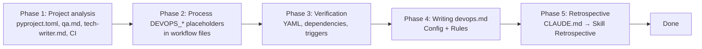

# DevOps Onboarding

## Overview

Setting up CI/CD project infrastructure.
Processes `${DEVOPS_*}` placeholders in template workflow files, verifies CI configuration, and writes the configuration to `.qarium/ai/employees/devops.md` for future sessions.

GitHub Actions is the only CI provider. No choice is offered.

## When to use

- The project has no `.qarium/ai/employees/devops.md` file
- The `/qarium:employees:devops` dispatch automatically directs here

**Do NOT use when:**
- The `.qarium/ai/employees/devops.md` file already exists -- use `qarium:employees:devops:feature`
- This is not a Python project

## Template

This skill processes `${DEVOPS_*}` placeholders that were left by the lead onboarding in template files.

### Placeholder processing

Read workflow files and find all `${DEVOPS_*}` placeholders:

| Variable | Expected in | How to compute |
|----------|-------------|----------------|
| DEVOPS_TRIGGER_BRANCH | All workflows | Read `default_branch` from `.qarium/ai/employees/lead.md` Config. If not found — `git symbolic-ref refs/remotes/origin/HEAD 2>/dev/null`, fallback `master` |
| DEVOPS_PACKAGE_SNAKE | strictacode.yml, publish.yml | Read `[project.name]` from pyproject.toml, convert to snake_case |
| DEVOPS_LINT_CHECK_ARGS | lint.yml | From `qa.md` Config `lint_cmd` — extract check arguments (e.g. `check <source>/ tests/`) |
| DEVOPS_LINT_FORMAT_ARGS | lint.yml | From `qa.md` Config `format_cmd` — extract format arguments (e.g. `format --check <source>/ tests/`) |
| DEVOPS_PYTHON_MATRIX | tests.yml | Derive from `requires-python` (e.g. `>=3.10` → `["3.10", "3.11", "3.12", "3.13", "3.14"]`) |
| DEVOPS_TEST_CMD | tests.yml | From `qa.md` Config `run_tests_cmd`, or `pytest --tb=short` |
| DEVOPS_DEPLOY_CMD | docs.yml | From `tech-writer.md` Config `deploy_cmd`, or `mkdocs gh-deploy --force` |
| DEVOPS_PUBLISH_PYTHON | publish.yml | Derive from `requires-python`, typically `3.12` |
| DEVOPS_SC_* | strictacode.yml | Ask user for thresholds, use defaults if skipped |

Replace the entire `${DEVOPS_VARIABLE:="prompt"}` with the computed value. Do NOT modify `${QA_*}`, `${TECH_WRITER_*}` placeholders.

## Virtual Environment

Before executing any shell commands (pip, python), detect the project's virtual environment:

1. Check for `.venv/` in the project root
2. If not found, check for `venv/`
3. If found → prefix all commands: `source .venv/bin/activate && <command>` (or `source venv/bin/activate && <command>`)
4. If not found → execute `<command>` as-is

This applies to any phase that executes shell commands (pip, python).



## Phase 1: Project Analysis

Collecting information about the current state of the project.

1. **Python version** -- read `requires-python` from `[project]` in `pyproject.toml`. Extract the minimum version (e.g., `>=3.10` → `py310`). This determines the Python version matrix in CI. If not specified, use `py312` by default.
2. **Default branch** -- read `default_branch` from `.qarium/ai/employees/lead.md` Config. If `lead.md` does not exist -- try `git symbolic-ref refs/remotes/origin/HEAD 2>/dev/null | sed 's@^refs/remotes/origin/@@'` -- fallback `master`.
3. **Build system** -- determine from `[build-system]` requires: setuptools, hatchling, poetry-core, flit-core, pdm-backend.
4. **Source directory** -- find the main package in the project root (directory with `__init__.py`, e.g., `strictacode/`, `myapp/`).
5. **qa.md** -- if `.qarium/ai/employees/qa.md` exists, read the `## Config` section and extract:
   - `run_tests_cmd` -- test execution command
   - `lint_cmd` -- linting command
   - `format_cmd` -- format check command
   - Test dependency group name (from the group key in `[project.optional-dependencies]`, if specified)
6. **tech-writer.md** -- if `.qarium/ai/employees/tech-writer.md` exists, read the `## Config` section and extract:
   - `build_cmd` -- documentation build command
   - `deploy_cmd` -- documentation deploy command
   - Documentation dependency group name (from the group key in `[project.optional-dependencies]`, if specified)
7. **pyproject.toml** -- read the sections:
   - `[build-system]` -- requires, build-backend
   - `[project]` -- name, version, description
   - `[project.optional-dependencies]` -- all dependency groups
8. **Existing CI** -- check `.github/workflows/` for existing workflows.

Present the summary to the user before proceeding to Phase 2. The summary includes:
- Python version and build system
- Source directory
- Commands from qa.md (if it exists)
- Commands from tech-writer.md (if it exists)
- Dependency groups from pyproject.toml
- Presence/absence of existing workflows

## Phase 2: Process DEVOPS_* Placeholders

### Required workflows

Determine which workflows are needed:

| Workflow    | Detection                                                                             |
|-------------|---------------------------------------------------------------------------------------|
| Lint        | `[tool.ruff]` found in pyproject.toml AND qa.md exists (contains `lint_cmd`)          |
| Tests       | qa.md exists (contains `run_tests_cmd`)                                               |
| Docs        | tech-writer.md exists (contains `build_cmd`)                                          |
| Publish     | `[build-system]` and `[project]` with `name` exist in pyproject.toml                  |
| New Version | Always include alongside Publish. Creates X.Y.x version branches, sets as default.   |
| Strictacode | Always include by default. User can exclude during confirmation step. |

Present the detected set to the user. The user can:
- Confirm the detected set
- Exclude specific workflows
- Add additional workflows (strictacode thresholds if not already in template)

Wait for user confirmation before processing placeholders.

### Process placeholders

For each workflow file in `.github/workflows/`:

1. Read the file
2. Find all `${DEVOPS_*}` placeholders
3. Replace each with the computed value from Phase 1

For workflows the user excluded — delete the file from `.github/workflows/`.

For strictacode.yml — also create `.strictacode.yml` in the project root (if it does not already exist):

```yaml
loader:
  exclude:
    - tests
```

Do not overwrite an existing `.strictacode.yml`.

### Verify no placeholders remain

After processing, verify:
1. No `${DEVOPS_*}` placeholders remain in any workflow file
2. No `${QA_*}`, `${TECH_WRITER_*}` placeholders remain in workflow files (they shouldn't be there)

## Phase 3: Verification

1. Check YAML syntax of all modified workflow files
2. Verify that dependency group names match `[project.optional-dependencies]` in pyproject.toml
3. Verify that trigger branches follow the project convention (from Phase 1 step 2)
4. Verify Python version matrix matches `requires-python`
5. Remind the user to commit and push to verify that the pipelines work

**When issues are detected:**
- Fix the issue
- Re-verify

## Phase 4: Writing `.qarium/ai/employees/devops.md`

Create the DevOps configuration file. The entire contents of the file are written in English.

### Generation Template

```markdown
# DevOps

## Config

| Key            | Value            | Description                                 |
|----------------|------------------|---------------------------------------------|
| ci_provider    | github-actions   | CI provider                                 |
| trigger_branch | <default_branch> | Default branch for triggers                 |
| diff_range     | HEAD~5           | Git diff range for auto-analysis in feature |

## Rules

### Workflow Registry

| Workflow | File | Trigger | Purpose |
|----------|------|---------|---------|

### Conventions

## Lessons

| Problem | Why | How to prevent |
|---------|-----|----------------|
```

- Fill in Config with values from Phase 1: `ci_provider` is always `github-actions`, `trigger_branch` is the project's default branch determined in Phase 1 step 2, `diff_range` is `HEAD~5` by default
- Fill in the Workflow Registry only with workflows actually kept after Phase 2 (exclude removed ones)
- Conventions -- empty placeholder for future expansion

### Rules

1. Create the `.qarium/ai/employees/` directory if it does not exist
2. If `.qarium/ai/employees/devops.md` already exists -- do NOT overwrite. Explain to the user and suggest using `qarium:employees:devops:feature`
3. Present the generated file for user approval before writing
4. After writing, verify the file's correctness by reading it back

## Common Mistakes

| Mistake                                                                      | Fix                                                                                       |
|------------------------------------------------------------------------------|-------------------------------------------------------------------------------------------|
| Creating a workflow for another provider                                     | Use only GitHub Actions -- no choice is offered                                           |
| Hardcoding Python version in workflow                                        | Determine from `requires-python` in pyproject.toml                                        |
| Hardcoding dependency group name                                             | Determine from qa.md/tech-writer.md Config or `[project.optional-dependencies]`           |
| Using default commands instead of commands from qa.md/tech-writer.md Config  | Always check qa.md and tech-writer.md first; defaults are only used when they are missing |
| Overwriting existing workflow files                                          | Check before creating -- only create files that are missing                               |
| Incorrect trigger branches                                                   | Follow the project convention (master vs main), as determined in Phase 1                  |
| Skipping verification in Phase 3                                             | Always verify YAML syntax and configuration consistency                                   |
| Including workflows not confirmed by the user                                | Create only workflows approved in Phase 2                                                 |
| Overwriting existing `.qarium/ai/employees/devops.md`                        | Check first; if found, suggest `qarium:employees:devops:feature`                          |
| Writing devops.md without user approval                                      | Present for review first                                                                  |
| Checking qa.md/tech-writer.md only when they exist, without fallback         | Always offer reasonable defaults when configuration is missing                            |
| Running `pip`/`python` without virtualenv activation                         | Always check for `.venv/` or `venv/` and use `source <venv>/bin/activate && <command>`    |
| Hardcoding `main` or `master` as trigger branch                              | Always determine from lead.md Config or git auto-detect                                   |
| Leaving `${DEVOPS_*}` placeholders in workflow files                         | All DEVOPS_* placeholders must be resolved in Phase 2                                     |
| Forgetting to create `.strictacode.yml` alongside strictacode workflow       | Always check for `.strictacode.yml` when keeping strictacode workflow                     |

## Phase 5: Retrospective

After completing all main work, perform the retrospective as defined in CLAUDE.md → Skill Retrospective.