# Lead Audit

## Overview

Compare lead-managed project files against the template and check `.qarium/ai/employees/lead.md` conventions.

## When to use

- The user selects `audit` in the lead dispatcher
- Periodic health check of lead configuration

## Template

Uses `.claude/templates/library/src/` as reference.

### Lead-managed files

| Template file | Project file | What to check |
|---------------|--------------|---------------|
| `{{lead:pyproject}}.toml` | `pyproject.toml` | Build system, requires-python, license, classifiers, dependencies, tool configs |
| `{{lead:.gitignore}}` | `.gitignore` | Missing patterns (docs/plans/, .claude/) |
| `{{lead:$src}}/__init__.py` | `<package>/__init__.py` | Source directory exists and named correctly |

### Lead-owned placeholders

Inline `${LEAD_PACKAGE_NAME}`, `${LEAD_PACKAGE_SNAKE}`, `${LEAD_DESCRIPTION}`, `${LEAD_REQUIRES_PYTHON}`, `${LEAD_LICENSE}`

Comment markers `# ${LEAD_CLASSIFIERS}`, `# ${LEAD_DEPENDENCIES}`, `# ${LEAD_ENTRY_POINTS}` — these are `# ${LEAD_*:="prompt"}` comments above the corresponding section.

Any remaining `${LEAD_*}` in project files is a finding.

```dot
digraph flow {
    rankdir=LR;
    template [label="Phase 1: Template audit\ncompare lead files vs template" shape=box];
    conventions [label="Phase 2: Convention audit\ncheck lead.md patterns" shape=box];
    report [label="Phase 3: Report\npresent findings" shape=box];
    fix [label="Phase 4: Fix approved issues" shape=box];
    retro [label="Phase 5: Retrospective\nCLAUDE.md → Skill Retrospective" shape=box];
    done [label="Done" shape=box];

    template -> conventions;
    conventions -> report;
    report -> fix [label="issues selected"];
    report -> retro [label="no issues"];
    fix -> retro;
    retro -> done;
}
```

## Phase 1: Template audit

### Read template and project files

1. Read template files from `.claude/templates/library/src/` that have `lead` in their `{{...}}` name
2. Read corresponding project files
3. Extract `${LEAD_*}` placeholders from template

### Checks

| Check | Status |
|-------|--------|
| `${LEAD_*}` placeholder found in project file | **unresolved** |
| `pyproject.toml` missing | **missing** |
| `.gitignore` missing | **missing** |
| Source directory `{{lead:$src}}` not renamed | **unrenamed** |
| `build-system` differs from template | **drift** |
| `requires-python` differs from template | **drift** |
| `[tool.setuptools.packages.find]` missing `include` | **missing** |
| `version` is hardcoded instead of dynamic | **inaccurate** |

## Phase 2: Convention audit

Read `.qarium/ai/employees/lead.md`:

| Check | Source | Status |
|-------|--------|--------|
| `default_branch` matches actual git branch | `git symbolic-ref` | **stale** if differs |
| Code Patterns still followed in source | Scan `*.py` | **violated** if not |
| Architecture Decisions still relevant | Check source | **stale** if outdated |
| TODO items still relevant | Check source | **stale** if resolved |
| LLM Directives still applicable | Check source | **violated** if not |

### Source code convention check

For each Code Pattern entry in lead.md, scan the source code:
1. If pattern describes import style → check 5-10 random files
2. If pattern describes naming → check constants, private members
3. If pattern describes error handling → check exception usage

Report percentage of files following each pattern.

## Phase 3: Report

Present findings:

| File / Section | Check | Status | Current | Expected |
|----------------|-------|--------|---------|----------|
| `pyproject.toml` | `${LEAD_LICENSE}` | **unresolved** | placeholder | actual license |

## Phase 4: Fix approved issues

The user selects which issues to fix. For each:

1. Read the affected file
2. Apply minimal fix
3. Verify

## Common mistakes

| Mistake | Fix |
|---------|-----|
| Only checking template, skipping conventions | Both phases are mandatory |
| Fixing without approval | Always present report first |
| Over-modifying files | Apply only the reported fix |
| Not checking TODO staleness | Scan source for resolved TODOs |

## Phase 5: Retrospective

After completing all main work, perform the retrospective as defined in CLAUDE.md → Skill Retrospective.