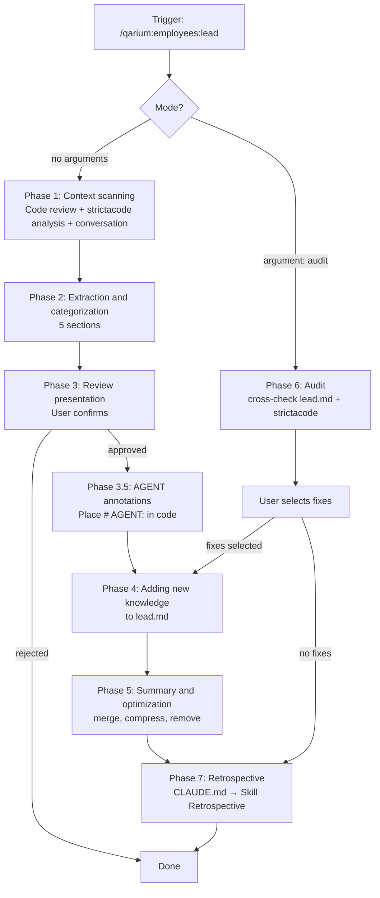

# Tech Lead Flow

## Overview

Knowledge accumulation skill for existing projects. Analyzes the current conversation and git changes, extracts technically important knowledge, suggests adding it to `.qarium/ai/employees/lead.md`, and optimizes the file to prevent unbounded growth.

Dispatch ensures that the file exists and contains populated sections before invoking this skill.

### Missing file

- If `.qarium/ai/employees/lead.md` does not exist — warn the user and suggest running `qarium:employees:lead:onboarding` first. Abort.
- If the file exists but all sections contain only `<!-- empty -->` — suggest `qarium:employees:lead:onboarding`.
- When reading the file, read the **Lessons** section if it exists — it contains project-specific lessons learned during past sessions.

## When to use

- The user runs `/qarium:employees:lead`
- Usually at the end of a session after completing a task
- After an important architectural decision
- When the user asks to check lead.md for relevance

**DO NOT use when:**
- The user did not ask to save knowledge
- The conversation just started and nothing significant has happened

## Sections

| Section                  | What to capture                                                                                               |
|--------------------------|---------------------------------------------------------------------------------------------------------------|
| Architecture & Decisions | Architectural decisions and rationale, technology choices, design trade-offs                                  |
| Project Structure        | Key files, dependencies, component relationships, module responsibilities                                     |
| Code Patterns            | Coding conventions, style, recurring patterns, naming conventions                                             |
| TODO                     | Unresolved issues, technical debt, findings from code reviews, tasks for future sessions                      |
| LLM Directives           | Specific rules for AI agents: what to do and what NOT to do when generating code                              |
| Config                   | Project-wide settings: default branch, etc. Not filled during knowledge accumulation, only checked in Phase 5 |

## Phase 1: Context Scanning

If the `audit` argument is present — skip this phase and proceed to Phase 6.

Analyze the current conversation and git changes for technically important information.

### Signals to look for

| Signal                                             | Example                                                  | Category                 |
|----------------------------------------------------|----------------------------------------------------------|--------------------------|
| 2+ approaches were discussed and one was chosen    | "We can use X or Y, let's go with Y"                     | Architecture & Decisions |
| A tool/library was adopted or rejected             | "Replaced Click with argparse"                           | Architecture & Decisions |
| A bug was found, diagnosed, and fixed              | "The problem was that the loader didn't handle generics" | TODO                     |
| LLM made a mistake requiring manual correction     | "Don't use mock for open, use tmp_path"                  | LLM Directives           |
| A pattern or convention was explicitly established | "All tests must use boundary comments"                   | Code Patterns            |
| A property of the project structure was discovered | "All loaders inherit from BaseLoader"                    | Project Structure        |
| A rule with "always" or "never" was formulated     | "Never run ruff on venv"                                 | LLM Directives           |
| An open task or technical debt emerged             | "Need to add caching to collector"                       | TODO                     |

### New Code Review (git diff + strictacode + conversation)

Execution order: change collection -> strictacode analysis -> mapping -> finding problems and AGENT instructions -> conversation.

#### Step 1: Change collection

1. `git diff` (unstaged) + `git diff --cached` (staged). If both are empty, `git diff HEAD~1`. If HEAD~1 is unavailable, list all `.py` files.
2. **Classify files** by status:
   - `A` (added) — new file or module
   - `D` (deleted) — possible stale entries
   - `M` (modified) — check diff for patterns

#### Step 2: strictacode analysis (if installed)

Check if the `strictacode` skill is available. If installed — invoke the skill to get a codebase health report. If not installed — skip without warning.

#### Step 3: Mapping changes to the strictacode report

If the strictacode report was received — map it against the modified files:
- Which problematic files from the report (high score, complexity density, pressure) were changed? Check the diff and assess how the changes affected these issues — worsened, unchanged, or starting to resolve
- Did any new problematic files appear among the changed ones?
- Which modified files fall into high refactoring/overengineering pressure zones?

#### Step 4: Analyzing diff for signals and problems

For each modified file, extract signals:

| What's in the diff                    | Signal                 | Category                                    |
|---------------------------------------|------------------------|---------------------------------------------|
| New module/library import             | New dependency         | Architecture & Decisions                    |
| New class/function in a new file      | New responsibility     | Project Structure                           |
| Function/method rename                | API change             | Code Patterns                               |
| `try/except`, `raise`, `RuntimeError` | Error handling pattern | Code Patterns                               |
| Deleted code, commented-out blocks    | Stale approach         | mark for Phase 5 (removal of stale entries) |
| `# TODO`, `# HACK`, `# FIXME`         | Technical debt         | TODO                                        |
| Public function signature changed     | Breaking change        | Project Structure                           |

**Assess the decisions made** — for each significant change:
- Why was this particular approach chosen? Are there alternatives?
- Is the decision consistent with existing entries in `lead.md`? If it violates a pattern — this is a problem
- Does the change introduce technical debt or a workaround?

**Find problems in the code** — check the diff for typical problems:
- Violations of established Code Patterns or LLM Directives
- Unhandled edge cases, missing validation
- Logic duplication that could be extracted into a shared module
- Abstraction leaks, encapsulation violations
- Overly broad function/method responsibility

For each problem found, formulate an `# AGENT:` instruction — a single-line or multi-line comment describing what needs to be done. Format:
- Single-line: `# AGENT: Extract _walk_swift_files into shared module`
- Multi-line: `# AGENT: Refactor this function to reduce complexity\n# Extract helper for validation logic\n# Extract helper for error formatting`

Each instruction must be specific enough for a future AI agent to execute without additional context.

#### Step 5: Conversation analysis

- If the diff shows a solution that was discussed in the conversation, this confirms the significance of the knowledge
- If the diff shows changes not mentioned in the conversation — extract them as well
- Extract signals from the conversation using the "Signals to look for" table above

### Significance filter

**Extract if:**
- The knowledge would prevent an error in a future session
- The knowledge would save time
- The rationale is not obvious
- An AI agent would make an incorrect decision without this knowledge

**Skip if:**
- The fact is obvious from reading the code
- The choice does not affect future work
- The rationale is generic ("because it's the standard tool")
- A passing detail with no long-term consequences

## Phase 2: Extraction and Categorization

Classify the extracted knowledge into 5 sections. For each entry:

1. Record the **essence** — what was decided or discovered
2. Record the **rationale** — why, context, or consequences
3. Assign the most appropriate section
4. Format: `- **Essence** — rationale`
5. **Deduplication** — read the current file and compare. Skip duplicates. Mark overlaps for Phase 3.

## Phase 3: Review Presentation

Read the current file for context. Present the review to the user in the following structure:

### Review structure

The review consists of three blocks. All blocks are mandatory but may contain "Nothing found" if there is no data.

**Block 1: New knowledge**
Extracted entries by section. For overlaps, show the existing entry alongside the proposed one and suggest a merged version.

**Block 2: Problems in the code**
Problems found during the git diff review (step 4 of Phase 1). For each problem:
- Problem description with file reference
- `# AGENT:` instruction text (single-line or multi-line)
- Exact location: `file:line` where the instruction should be placed

**Block 3: Impact on project health** (only if strictacode analysis was performed)
Findings from mapping the strictacode report against the modified files:
- Overall impact of changes (worsened/improved/neutral)
- Problematic files from the report affected by the changes
- Action options for improving metrics

### User actions

The user can:
- Approve/reject/modify individual knowledge entries
- Select `# AGENT:` instructions from Block 2 — approved instructions will be placed in the source code at the specified location
- Select action options for improving metrics from Block 3 — approved ones should be added to **TODO**
- Add their own entries
- Reject the entire package

Wait for approval.

## Phase 3.5: AGENT Annotations

For each approved `# AGENT:` instruction from Block 2 of Phase 3:

1. Read the target file
2. Place the instruction **on the line immediately before** the relevant function/class/code block
3. Multi-line: `# AGENT: First line\n# Second line\n# Third line`
4. Single-line: `# AGENT: Single instruction`
5. DO NOT modify any code — only add comment lines

## Phase 4: Adding New Knowledge

Add approved entries to `.qarium/ai/employees/lead.md`. All file content is written in English.

1. Read the current file
2. In empty sections (containing only `<!-- empty -->`) replace the comment with new entries
3. In populated sections, add new entries after the existing ones

DO NOT modify, reformat, or delete existing entries in this phase.

## Phase 5: Summary and Optimization

After adding, analyze **all** sections and optimize.

### Merging duplicates

If multiple entries describe the same fact, merge into one. Keep the most informative version.

### Resolving contradictions

If entries contradict each other, keep the one that matches the current codebase. Verify by reading the source file. If the state is ambiguous — keep both and mark for the next review.

### Compressing verbose entries

Shorten excessive rationale to the essence.

### Removing stale entries

Remove only verified entries — verify by reading the source file:
- A workaround is no longer needed — the code has been changed
- An abandoned approach — no traces left in the codebase

If verification is not possible — keep the entry.

### TODO optimization

The TODO section contains tasks, not stable knowledge. During optimization:
- **Remove** tasks that are already completed — verify by reading the source code that the problem is resolved
- **Merge** duplicate tasks (the same problem described twice from different angles)
- **Do not remove** tasks without verification — even if they seem stale

TODO is not included in the list of protected sections.

### Config updates

Check if `default_branch` in Config matches the current default branch (determined via `git symbolic-ref refs/remotes/origin/HEAD 2>/dev/null`). If it doesn't match — update it. Do not add other keys to Config.

### Protected entries

Never compress, merge, or delete:
- Entries with **"NEVER"** or **"Always"** directives
- The entire **LLM Directives** section

Protected entries can only be modified by the user during Phase 3 review.

### Size limit

After optimization, the total number of entries (lines starting with `- `) must be **no more than 20% larger** than before the updates. Exception: fewer than 20 entries — skip optimization.

## Phase 6: Audit

Used when the user asks to check lead.md for discrepancies with the actual state of the codebase — without analyzing the conversation or git diff. This phase replaces Phases 1-3. Argument `audit`.

### How to conduct the audit

1. Read `.qarium/ai/employees/lead.md` completely
2. Identify `<source>` — the main package directory (directories with `__init__.py`, excluding `tests/`)
3. For each check, collect data and form entries in the report

**Check 1: Architecture & Decisions sync**

For each entry, read the corresponding source file and verify:
- `ok` — the described decision is confirmed by the code
- `stale` — the approach is no longer used (module removed, pattern replaced)
- `incomplete` — partially confirmed (e.g., adapter pattern described but some backends removed)

**Check 2: Code Patterns compliance**

For each entry, analyze the code for pattern compliance:
- `ok` — the pattern is followed across the entire codebase
- `violated` — violations found
- `stale` — the pattern is no longer used

**Check 3: TODO sync**

For each TODO entry, check the code for problem resolution:
- `stale` — the task is completed (code changed, problem resolved)
- `ok` — the task is still relevant

**Check 4: LLM Directives compliance**

For each directive (especially with NEVER/Always), check the code for compliance:
- `ok` — the directive is followed
- `violated` — a violation was found

**Check 5: lead.md format**

| Check                                          | Status         |
|------------------------------------------------|----------------|
| Missing `## Architecture & Decisions`          | **inaccurate** |
| Missing `## Project Structure`                 | **inaccurate** |
| Missing `## Code Patterns`                     | **inaccurate** |
| Missing `## TODO`                              | **inaccurate** |
| Missing `## LLM Directives`                    | **inaccurate** |
| Missing `## Config`                            | **inaccurate** |
| Section with entries contains `<!-- empty -->` | **inaccurate** |

**Check 6: Config sync**

| Check                                       | Status on discrepancy                                  |
|---------------------------------------------|--------------------------------------------------------|
| `default_branch` in Config differs from git | Verify via `git symbolic-ref refs/remotes/origin/HEAD` |

### strictacode summary

Check if the `strictacode` skill is available. If installed — invoke the skill to get a codebase health report. Form a brief summary — only the most important:

- Top-3 files with the highest score
- Files with high refactoring/overengineering pressure
- Overall assessment: "healthy" / "needs attention" / "critical"

If strictacode is not installed — skip without warning.

### Audit report

Form a table:

| Section                  | Record                                | Status         | Details                                           |
|--------------------------|---------------------------------------|----------------|---------------------------------------------------|
| Architecture & Decisions | Adapter pattern for multi-backend     | **incomplete** | `backend_x` removed, only `backend_y` remains     |
| Code Patterns            | Absolute package-relative imports     | **violated**   | `src/module.py:42` uses wildcard import           |
| TODO                     | Add caching to collector              | **stale**      | Caching implemented in commit abc1234             |
| LLM Directives           | NEVER add fetch-depth: 0              | **ok**         |                                                   |
| Format                   | `<!-- empty -->` in Project Structure | **inaccurate** | Section has records but also contains placeholder |

### Example strictacode summary in the report

- Top score: `src/complex.py` (score: 45)
- Refactoring pressure: `src/loader.py`, `src/collector.py`
- Overall: needs attention

### Status values

- **ok** — confirmed by the code
- **stale** — outdated (code has changed)
- **violated** — violated in the current code
- **incomplete** — partially confirmed
- **inaccurate** — format violation

### After the audit

1. Present the audit table + strictacode summary to the user
2. Ask which problems to fix
3. For approved fixes — follow Phases 4-5 (addition + optimization)
4. For `violated` — suggest adding a remark to TODO or LLM Directives

## Common mistakes

| Mistake                                         | Fix                                                                                             |
|-------------------------------------------------|-------------------------------------------------------------------------------------------------|
| Saving trivial facts                            | Apply the significance filter                                                                   |
| Overwriting existing entries in Phase 4         | Only add — cleanup happens in Phase 5                                                           |
| Saving transient context                        | Save stable patterns and decisions                                                              |
| Ignoring rationale                              | Always save *why*, not just *what*                                                              |
| Deleting useful context during optimization     | Remove only verified entries                                                                    |
| Compressing LLM Directives or NEVER/Always      | They are protected                                                                              |
| Resolving contradictions without verification   | Verify against the source code                                                                  |
| Increasing entries by more than 20%             | Continue optimization                                                                           |
| Skipping Phase 5                                | Always optimize — accumulation is unbounded                                                     |
| Ignoring LLM errors                             | The most valuable signals for vibe coding                                                       |
| Not replacing `<!-- empty -->` in Phase 4       | Replace placeholders with entries                                                               |
| Running audit with conversation analysis        | Audit (Phase 6) works without conversation and git diff — only cross-checking lead.md with code |
| Modifying entries during audit without approval | Audit only reports — changes require user approval                                              |
| Skipping strictacode during audit               | Always invoke strictacode if the skill is available                                             |
| Overwriting Config during Phase 5               | Only update `default_branch` if it has changed; do not add or remove other Config keys          |
| Editing source code directly instead of placing AGENT annotations | Only add `# AGENT:` comments — actual code changes are done by agents in future sessions |

## Phase 7: Retrospective

After completing all main work, perform the retrospective as defined in CLAUDE.md → Skill Retrospective.
