# Technical Lead Onboarding

## Overview

Bootstrap a new Python project from a template and create `.qarium/ai/employees/lead.md` with populated sections based on discovered patterns, architecture, and structure.

## When to use

- The file `.qarium/ai/employees/lead.md` does not exist
- The file exists but all sections contain only `<!-- empty -->`
- The `/qarium:employees:lead` dispatcher automatically routes here

**Do NOT use when:**
- The file exists and contains populated sections — use `qarium:employees:lead:feature`
- It is not a Python project

## Template

This skill uses a project template for initial setup. The template contains configuration files with dynamic placeholders.

### Template location

The template is in `.claude/templates/library/src/` (within the ai-python repository).

### Placeholder syntax

Files contain placeholders in bash default variable syntax: `${ROLE_VARIABLE:="prompt"}`

- **ROLE** — identifies which role fills this variable (LEAD, QA, DEVOPS, TECH_WRITER)
- **VARIABLE** — named value to compute
- **"prompt"** — instruction for the AI on what to compute and how

Process ONLY `${LEAD_*}` variables. Leave other roles' placeholders (`${QA_*}`, `${DEVOPS_*}`, `${TECH_WRITER_*}`) unchanged — they will be processed by their respective onboarding skills.

Replace the entire `${LEAD_VARIABLE:="prompt"}` expression with the computed value.

### Directory/file naming

Template directories and files use `{{role:name}}` naming:
- `{{role:literal_name}}` — rename to `literal_name` (e.g. `{{lead:pyproject}}.toml` → `pyproject.toml`)
- `{{role:$variable}}` — rename to the value of the variable prefixed with `$` (e.g. `{{lead:$src}}` → value of LEAD_PACKAGE_SNAKE)
- Directories/files without `{{...}}` keep their names as-is

```dot
digraph flow {
    rankdir=LR;
    template [label="Phase 0: Template setup\ncopy, rename, process LEAD_* vars" shape=box];
    analyze [label="Phase 1: Project analysis\nsource structure, source code" shape=box];
    fill [label="Phase 2: Filling sections\nArchitecture, Structure, Patterns" shape=box];
    review [label="Phase 3: Review\nuser confirms" shape=box];
    write [label="Phase 4: Writing\n.qarium/ai/employees/lead.md" shape=box];
    retro [label="Phase 5: Retrospective\nCLAUDE.md → Skill Retrospective" shape=box];
    done [label="Done" shape=box];

    template -> analyze;
    analyze -> fill;
    fill -> review;
    review -> write [label="approved"];
    review -> done [label="rejected"];
    write -> retro;
    retro -> done;
}
```



## Phase 0: Template setup

### Step 1: Copy template files

1. Copy only files and directories with `{{lead:...}}` naming from `.claude/templates/library/src/` to the project root. Do NOT copy files belonging to other roles (`{{devops:...}}`, `{{tech-writer:...}}`, `{{qa:...}}`)
2. Do NOT overwrite existing files — skip if a file with the target name already exists
3. Keep `{{...}}` names for now — renaming happens in Step 3

### Step 2: Collect LEAD_* variable values

Before renaming, collect the values for LEAD_* variables by asking the user:

| Variable | Prompt | Source |
|----------|--------|--------|
| LEAD_PACKAGE_NAME | Package name in kebab-case (e.g. my-awesome-lib) | Ask user |
| LEAD_PACKAGE_SNAKE | Package dir in snake_case | Auto-derived from LEAD_PACKAGE_NAME (e.g. `some-name` → `some_name`). Propose to user for confirmation |
| LEAD_DESCRIPTION | One-line package description | Ask user |
| LEAD_REQUIRES_PYTHON | Minimum Python version | Ask user, default `>=3.10` |
| LEAD_LICENSE | License identifier | Ask user: MIT, BSD-3-Clause, Apache-2.0, GPL-3.0-or-later, or skip |

Additional sections with comment markers (not inline `${...}`, but `# ${LEAD_*:="prompt"}` above the section):

| Variable | How to compute |
|----------|---------------|
| LEAD_CLASSIFIERS | All Python minor versions from minimum to 3.14, Development Status, Intended Audience |
| LEAD_DEPENDENCIES | Ask user for runtime dependencies |
| LEAD_ENTRY_POINTS | Only if library provides plugins — remove section if not applicable |

Present all collected values to the user for confirmation before proceeding.

### Step 3: Rename template directories and files

Rename all `{{...}}` entries:

| Template name | Target name |
|---------------|-------------|
| `{{lead:pyproject}}.toml` | `pyproject.toml` |
| `{{lead:.gitignore}}` | `.gitignore` |
| `{{lead:$src}}/` | `<LEAD_PACKAGE_SNAKE>/` |

### Step 4: Process LEAD_* placeholders

Read each copied file, find all `${LEAD_*}` placeholders and replace them with the collected values:

1. Read the file
2. Find `${LEAD_VARIABLE:="prompt"}` patterns
3. Replace with the computed value
4. Write the updated file

For `${LEAD_CLASSIFIERS:="..."}` — replace the entire classifiers array with generated values based on LEAD_REQUIRES_PYTHON.

For `${LEAD_DEPENDENCIES:="..."}` — replace with actual dependencies collected from user, formatted as TOML array entries.

For `${LEAD_ENTRY_POINTS:="..."}` — either fill in the entry points or remove the commented section entirely if not applicable.

### Step 5: Verify

1. Read `pyproject.toml` — verify all `${LEAD_*}` placeholders are replaced, TOML is valid
2. Read `.gitignore` — verify it exists
3. Check `<LEAD_PACKAGE_SNAKE>/__init__.py` — verify it exists

Present a summary of created files and remaining placeholders.

## Phase 1: Project analysis

Analyze the project now that template files are in place.

1. **Project metadata** — read `pyproject.toml` and extract:
   - Project name, description, project type, build system, entry points
2. **Source structure** — traverse the directory tree, identify packages and subdirectories
3. **Default branch** — determine the project's default branch:
   - Try `git symbolic-ref refs/remotes/origin/HEAD 2>/dev/null | sed 's@^refs/remotes/origin/@@'`
   - If that fails, try `git branch --show-current`
   - If that fails, ask the user (`master` or `main`)
4. **Source code** — read key files in the package root to discover patterns:
   - Import style (absolute, relative, wildcard)
   - Error handling (exceptions, Result types, error codes)
   - Naming conventions (private with underscore, UPPER_SNAKE_CASE for constants)
   - Base classes, inheritance, abstractions

Present a brief summary of what was discovered before moving to Phase 2.

## Phase 2: Filling sections

Based on the analysis from Phase 1, generate entries for each section.

### What to fill

| Section                  | Sources                                                 | Fill                      |
|--------------------------|---------------------------------------------------------|---------------------------|
| Architecture & Decisions | `[build-system]`, project type, key patterns in code    | Yes                       |
| Project Structure        | directory structure, packages, entry points             | Yes                       |
| Code Patterns            | naming conventions, import style, error handling        | Yes                       |
| TODO                     | —                                                       | Empty (`<!-- empty -->`)  |
| LLM Directives           | —                                                       | Empty (`<!-- empty -->`)  |

Additionally, fill the Config section:
- `default_branch` — from Phase 1 step 3 (default branch detection)

### Record format

Each entry: `- **Essence** — justification`

Examples:

```markdown
## Architecture & Decisions
- **Adapter pattern for multi-backend support** — allows switching backends without changing business logic
- **Click for CLI** — standard Python CLI framework

## Project Structure
- **Core logic in app/domain/** — business entities isolated from infrastructure
- **Configuration in config.py** — single application configuration entry point

## Code Patterns
- **Absolute package-relative imports** — `from .module import Class`
- **Subprocess failures raise RuntimeError(stderr)** — consistent pattern for external process error handling
```

### Significance filter

Do not record obvious facts. Record only if:
- The knowledge will save time in a future session
- The justification is not obvious
- The AI agent would make an incorrect decision without this knowledge

## Phase 3: Review

Present the full file contents to the user. The user can:
- Remove individual entries
- Change wording
- Add their own entries
- Reject the entire batch

Wait for approval.

## Phase 4: Writing

Create `.qarium/ai/employees/lead.md` with the approved contents. All file contents are written in English.

### Rules

1. If the file does not exist — create it
2. If the file exists with empty sections — overwrite it
3. If the file exists with populated sections — do NOT overwrite. Explain and suggest `qarium:employees:lead:feature`
4. Use UTF-8 encoding

### File template

```markdown
# Lead

## Config

| Key            | Value  | Description                                  |
|----------------|--------|----------------------------------------------|
| default_branch | master | Default branch for CI triggers and diff base |

## Architecture & Decisions
<approved entries>

## Project Structure
<approved entries>

## Code Patterns
<approved entries>

## TODO
<!-- empty -->

## LLM Directives
<!-- empty -->

## Lessons

| Problem | Why | How to prevent |
|---------|-----|----------------|
```

After writing, read the file back for verification.

## Common mistakes

| Mistake                                           | Fix                                                                     |
|---------------------------------------------------|-------------------------------------------------------------------------|
| Processing non-LEAD placeholders                  | Only process `${LEAD_*}` — leave `${QA_*}`, `${DEVOPS_*}`, `${TECH_WRITER_*}` untouched |
| Overwriting existing files during template copy    | Skip files that already exist in the project                            |
| Skipping Phase 3 (review)                         | Always present for approval                                             |
| Recording obvious facts ("we use Python")         | Apply the significance filter                                           |
| Examples tied to a specific project               | Use generic examples, not from the current project                      |
| Skipping default_branch detection in Phase 1      | Always detect via git or ask the user; other roles depend on this value |
| Forgetting to include Config in the file template | Config section must always be present in lead.md                        |
| Hardcoding `version = "0.1.0"` in `[project]`     | Always use `dynamic = ["version"]` with setuptools-scm                   |
| Leaving `${LEAD_*}` placeholders in files         | All LEAD_* placeholders must be resolved before moving to Phase 1       |
| Not renaming `{{lead:$src}}` directory            | Must rename to LEAD_PACKAGE_SNAKE value                                 |
| Copying non-lead template files (devops, tech-writer) | Only copy files with `{{lead:...}}` naming — other roles copy their own files via their onboarding skills |

## Phase 5: Retrospective

After completing all main work, perform the retrospective as defined in CLAUDE.md → Skill Retrospective.