# Technical Lead Onboarding

## Overview

Analysis of a Python project and creation of `.qarium/ai/employees/lead.md` with populated sections based on discovered patterns, architecture, and structure.

## When to use

- The file `.qarium/ai/employees/lead.md` does not exist
- The file exists but all sections contain only `<!-- empty -->`
- The `/qarium:employees:lead` dispatcher automatically routes here

**Do NOT use when:**
- The file exists and contains populated sections — use `qarium:employees:lead:feature`
- It is not a Python project

```dot
digraph flow {
    rankdir=LR;
    analyze [label="Phase 1: Project analysis\npyproject.toml, source structure" shape=box];
    fill [label="Phase 2: Filling sections\nArchitecture, Structure, Patterns" shape=box];
    review [label="Phase 3: Review\nuser confirms" shape=box];
    write [label="Phase 4: Writing\n.qarium/ai/employees/lead.md" shape=box];
    retro [label="Phase 5: Retrospective\nCLAUDE.md → Skill Retrospective" shape=box];
    done [label="Done" shape=box];

    analyze -> fill;
    fill -> review;
    review -> write [label="approved"];
    review -> done [label="rejected"];
    write -> retro;
    retro -> done;
}
```



## Phase 1: Project analysis

Collecting information about the current state of the Python project.

1. **Project metadata** — read `pyproject.toml` (if it does not exist — suggest the user invoke `qarium:employees:devops` for project setup, and stop) and extract:
   - Project name (`[project.name]`)
   - Project type: library (no `scripts`), CLI application (with `[project.scripts]` or click/typer), web application (fastapi/django/flask)
   - Build system from `[build-system]` requires: setuptools/hatchling/poetry-core/flit-core/pdm-backend
   - Entry points (`[project.scripts]`)
2. **Source structure** — find the main package directory (with `__init__.py`), traverse the directory tree, identify packages and subdirectories
3. **Default branch** — determine the project's default branch:
   - Try `git symbolic-ref refs/remotes/origin/HEAD 2>/dev/null | sed 's@^refs/remotes/origin/@@'`
   - If that fails, try `git branch --show-current`
   - If that fails, ask the user (`master` or `main`)
4. **Source code** — read key files in the package root to discover patterns:
   - Import style (absolute, relative, wildcard)
   - Error handling (exceptions, Result types, error codes)
   - Naming conventions (private with underscore, UPPER_SNAKE_CASE for constants)
   - Base classes, inheritance, abstractions

Present a brief summary of what was discovered before moving to Phase 2.

## Phase 2: Filling sections

Based on the analysis from Phase 1, generate entries for each section.

### What to fill

| Section                  | Sources                                                 | Fill                      |
|--------------------------|---------------------------------------------------------|---------------------------|
| Architecture & Decisions | `[build-system]`, project type, key patterns in code    | Yes                       |
| Project Structure        | directory structure, packages, entry points             | Yes                       |
| Code Patterns            | naming conventions, import style, error handling        | Yes                       |
| TODO                     | —                                                       | Empty (`<!-- empty -->`)  |
| LLM Directives           | —                                                       | Empty (`<!-- empty -->`)  |

Additionally, fill the Config section:
- `default_branch` — from Phase 1 step 3 (default branch detection)

### Record format

Each entry: `- **Essence** — justification`

Examples:

```markdown
## Architecture & Decisions
- **Adapter pattern for multi-backend support** — allows switching backends without changing business logic
- **Click for CLI** — standard Python CLI framework

## Project Structure
- **Core logic in app/domain/** — business entities isolated from infrastructure
- **Configuration in config.py** — single application configuration entry point

## Code Patterns
- **Absolute package-relative imports** — `from .module import Class`
- **Subprocess failures raise RuntimeError(stderr)** — consistent pattern for external process error handling
```

### Significance filter

Do not record obvious facts. Record only if:
- The knowledge will save time in a future session
- The justification is not obvious
- The AI agent would make an incorrect decision without this knowledge

## Phase 3: Review

Present the full file contents to the user. The user can:
- Remove individual entries
- Change wording
- Add their own entries
- Reject the entire batch

Wait for approval.

## Phase 4: Writing

Create `.qarium/ai/employees/lead.md` with the approved contents. All file contents are written in English.

### Rules

1. If the file does not exist — create it
2. If the file exists with empty sections — overwrite it
3. If the file exists with populated sections — do NOT overwrite. Explain and suggest `qarium:employees:lead:feature`
4. Use UTF-8 encoding

### File template

```markdown
# Lead

## Config

| Key            | Value  | Description                                  |
|----------------|--------|----------------------------------------------|
| default_branch | master | Default branch for CI triggers and diff base |

## Architecture & Decisions
<approved entries>

## Project Structure
<approved entries>

## Code Patterns
<approved entries>

## TODO
<!-- empty -->

## LLM Directives
<!-- empty -->

## Lessons

| Problem | Why | How to prevent |
|---------|-----|----------------|
```

After writing, read the file back for verification.

## Common mistakes

| Mistake                                           | Fix                                                                     |
|---------------------------------------------------|-------------------------------------------------------------------------|
| Filling TODO or LLM Directives during onboarding  | Leave empty — feature will fill from dialogue context                   |
| Overwriting existing populated sections           | Check first — if populated, suggest feature                             |
| Recording obvious facts ("we use Python")         | Apply the significance filter                                           |
| Skipping Phase 3 (review)                         | Always present for approval                                             |
| Examples tied to a specific project               | Use generic examples, not from the current project                      |
| Skipping default_branch detection in Phase 1      | Always detect via git or ask the user; other roles depend on this value |
| Forgetting to include Config in the file template | Config section must always be present in lead.md                        |
| Hardcoding `version = "0.1.0"` in `[project]`     | Always use `dynamic = ["version"]` with setuptools-scm                   |
| Using `setuptools>=75.0` in `[build-system]`      | Use `setuptools>=61.0` as minimum version                               |
| Missing `include` in `[tool.setuptools.packages.find]` | Always set `include = ["<package_name>*"]` based on the main package directory |
| Leaving `uv.lock` in the project after setup      | Delete `uv.lock` if it was created — it must not be committed            |

## Phase 5: Retrospective

After completing all main work, perform the retrospective as defined in CLAUDE.md → Skill Retrospective.
