# QA Audit

## Overview

Compare QA-managed configuration against the template and check `.qarium/ai/employees/qa.md` conventions.

## When to use

- The user selects `audit` in the QA dispatcher
- Periodic health check of test configuration

## Template

Uses `.claude/templates/library/src/` as reference.

### QA-managed sections in pyproject.toml

| Section | What to check |
|---------|---------------|
| `[tool.ruff]` | `target-version` matches `requires-python`, `src` matches package dir |
| `[tool.ruff.lint]` | `select` and `ignore` match template |
| `[tool.ruff.format]` | `quote-style`, `indent-style` |
| `[tool.pytest.ini_options]` | `testpaths`, `addopts` |
| `[tool.coverage.run]` | `source` matches package dir, `branch = true` |
| `[tool.coverage.report]` | `show_missing`, `skip_empty` |
| `[project.optional-dependencies]` | Test group exists and contains correct deps |

### QA-owned placeholders

`${QA_PACKAGE_SNAKE}`, `${QA_TARGET_VERSION}`

Any remaining `${QA_*}` in project files is a finding.

```dot
digraph flow {
    rankdir=LR;
    template [label="Phase 1: Template audit\ncompare QA configs vs template" shape=box];
    conventions [label="Phase 2: Convention audit\ncheck qa.md rules" shape=box];
    report [label="Phase 3: Report\npresent findings" shape=box];
    fix [label="Phase 4: Fix approved issues" shape=box];
    retro [label="Phase 5: Retrospective\nCLAUDE.md → Skill Retrospective" shape=box];
    done [label="Done" shape=box];

    template -> conventions;
    conventions -> report;
    report -> fix [label="issues selected"];
    report -> retro [label="no issues"];
    fix -> retro;
    retro -> done;
}
```

## Phase 1: Template audit

### Read template and project files

1. Read template `pyproject.toml` — extract QA sections (`[tool.ruff]`, `[tool.pytest]`, `[tool.coverage]`)
2. Read project `pyproject.toml` — extract same sections
3. Compare structure and values

### Checks

| Check | Status |
|-------|--------|
| `${QA_*}` placeholder in pyproject.toml | **unresolved** |
| `[tool.ruff]` section missing | **missing** |
| `target-version` doesn't match `requires-python` | **inaccurate** |
| `src` doesn't match actual package dir | **inaccurate** |
| `[tool.pytest.ini_options]` missing | **missing** |
| `[tool.coverage.run]` source wrong | **inaccurate** |
| Test dependency group missing | **missing** |
| `tests/` directory missing | **missing** |
| `tests/__init__.py` missing | **missing** |

## Phase 2: Convention audit

Read `.qarium/ai/employees/qa.md`:

| Check | Source | Status |
|-------|--------|--------|
| Config commands work | Run each command | **broken** if fails |
| Mapping covers all source files | Scan source vs mapping | **missing** if uncovered |
| Conventions followed in tests | Scan `tests/` | **violated** if not |
| Mock Patterns still in use | Scan `tests/` | **stale** if unused |
| Helpers referenced correctly | Check imports | **broken** if missing |

### Command verification

Run each command from Config:
1. `lint_cmd` — must exit 0 on clean code
2. `format_cmd` — must exit 0 on formatted code
3. `run_tests_cmd` — must discover and run tests

### Mapping coverage

1. List all source files matching project patterns
2. Compare with Mapping entries
3. Report unmapped source files

## Phase 3: Report

Present findings:

| File / Section | Check | Status | Current | Expected |
|----------------|-------|--------|---------|----------|
| `pyproject.toml` | `target-version` | **inaccurate** | `py312` | `py310` |

## Phase 4: Fix approved issues

The user selects which issues to fix. For each:

1. Read the affected file
2. Apply minimal fix
3. Verify

## Common mistakes

| Mistake | Fix |
|---------|-----|
| Running commands without virtualenv | Check for `.venv/` or `venv/` first |
| Only checking pyproject.toml | Also check tests/ structure and qa.md |
| Fixing mapping without source verification | Always verify source files exist |

## Phase 5: Retrospective

After completing all main work, perform the retrospective as defined in CLAUDE.md → Skill Retrospective.