# QA

## Overview

Skill for test coverage after implementation.
Triggered after code changes to fix broken tests and write new tests for modified files.
Uses pytest with ruff for linting and formatting.
Reads test configuration from `.qarium/ai/employees/qa.md` (section `## Rules`).
Updates data in `.qarium/ai/employees/qa.md`. All file content is written in English.

## When to use

- After completing a feature or fixing a bug
- After a series of commits without tests
- When existing tests fail after code changes
- When the user asks to check qa.md for discrepancies with the actual state of tests

```dot
digraph flow {
    rankdir=LR;
    mode [label="Mode?" shape=diamond];
    detect [label="Phase 1: Change detection\ngit diff, read Rules" shape=box];
    run [label="Phase 2: Run existing tests\npytest --tb=long" shape=box];
    failing [label="Tests failing?" shape=diamond];
    diagnose [label="Phase 3: Failure diagnosis\nfix tests or explain" shape=box];
    plan [label="Phase 4: Test planning\npresent for review" shape=box];
    approved [label="Approved?" shape=diamond];
    generate [label="Phase 5: Test generation\nunit, edge, integration" shape=box];
    verify [label="Phase 6: Verification\npytest + lint + format" shape=box];
    clean [label="All green?" shape=diamond];
    regress [label="Regression?\nlikely a bug in sources" shape=diamond];
    update [label="Phase 7: Update Rules\nsync with .qarium/ai/employees/qa.md" shape=box];
    audit [label="Phase 8: Audit\ncross-check qa.md" shape=box];
    audit_fix [label="User selects fixes" shape=box];
    retro [label="Phase 9: Retrospective\nCLAUDE.md → Skill Retrospective" shape=box];
    done [label="Done" shape=box];

    mode -> detect [label="no arguments"];
    mode -> audit [label="argument: audit"];
    detect -> run;
    run -> failing;
    failing -> diagnose [label="yes"];
    failing -> plan [label="no"];
    diagnose -> run;
    plan -> approved;
    approved -> generate [label="yes"];
    approved -> done [label="rejected"];
    generate -> regress [label="sources broken"];
    generate -> verify [label="tests written"];
    regress -> done [label="explain to user"];
    verify -> clean;
    clean -> generate [label="no"];
    clean -> update [label="yes"];
    update -> retro;
    audit -> audit_fix;
    audit_fix -> update [label="fixes selected"];
    audit_fix -> retro [label="no fixes"];
    retro -> done;
}
```



**DO NOT use when:**
- TDD skill has already covered the changes
- Changes only affect documentation, CI configuration, or README
- The user explicitly asked to skip tests

## Virtual Environment

Before executing any shell commands (pytest, ruff), detect the project's virtual environment:

1. Check for `.venv/` in the project root
2. If not found, check for `venv/`
3. If found → prefix all commands: `source .venv/bin/activate && <command>` (or `source venv/bin/activate && <command>`)
4. If not found → execute `<command>` as-is

This applies to all phases that run shell commands: Phase 2, Phase 3, Phase 5, Phase 6, Phase 8.

## Phase 1: Change detection

If the argument is `audit` — skip this phase and go to Phase 8.

1. Read `.qarium/ai/employees/qa.md` and extract the **Rules** section, if it exists. This section defines project-specific test configuration.
2. Read the **Lessons** section, if it exists — it is a top-level section in qa.md (not inside Rules). Contains project-specific lessons learned during past sessions.
3. Determine the **source directory** — the main package directory (e.g., `myapp/`). Look for directories with `__init__.py` in the project root, excluding `tests/`. This will be used as `<source>` in subsequent phases.
4. Collect modified files using `git diff --name-status HEAD` (staged + unstaged + untracked). Returns statuses: `A` (added), `D` (deleted), `M` (modified), `R` (renamed). If empty, use `git diff --name-status HEAD~1`. If `HEAD~1` is unavailable (single commit or detached HEAD), list all tracked `.py` files in `<source>/`.
5. Add untracked `.py` files: run `git ls-files --others --exclude-standard` and classify as `A` (added). This allows finding new files not yet added to the index.
6. If the skill is invoked with a path argument, use only files at that path.
7. Filtering: keep only `.py` files in `<source>/`. Skip configs, documentation, CI, and non-source-code files.
8. Classify each file by status from `--name-status`: **new** (`A`), **deleted** (`D`), **renamed** (`R` — displayed as two paths: old->new), or **existing** (`M`).
9. **Module-to-package refactoring detection** — check for the following signals:
   - Source file deleted (`D`) and a new directory with the same name and `__init__.py` exists (e.g., `module.py` deleted, `module/__init__.py` added) — classify as **refactoring to package**
   - Source file renamed (`R`) from `module.py` to `module/__init__.py` — classify as **refactoring to package**
   - Source file still exists, but a new directory with the same name and `__init__.py` also exists — classify as **refactoring to package** (module kept alongside the new package)
   Consider all new files inside the new package as part of this refactoring. Find the original module path in the existing Mapping to determine the location of existing tests — that is where they are.

## Phase 2: Run existing tests

Determine which tests to run using the **Mapping** from `.qarium/ai/employees/qa.md`:
- If Mapping exists — use it to find test files for modified files, run only those first
- If no Mapping — run `pytest --tb=long` for the full suite

If pytest found no tests, go to Phase 4 — nothing to diagnose.

If all targeted tests passed, run the full suite for regression check. If the full suite also passed, go to Phase 4. If there are failures — go to Phase 3.

## Phase 3: Failure diagnosis

Analyze each failing test using the full traceback from Phase 2:

1. **AssertionError** — test expects old behavior. Compare the assert with current code, fix the test.
2. **ImportError / ModuleNotFoundError** — import structure changed. Update imports. If the cause is module-to-package refactoring (a `.py` module replaced with a `/` package), also check Phase 1 step 8 — the existing test file may need to be moved to a mirror package directory, not just have imports fixed.
3. **AttributeError / TypeError** — API changed (renamed method, different signature). Update calls.
4. **ValueError** — input validation changed. Update test data to match new constraints.
5. **KeyError / IndexError** — data structure changed. Update test data access patterns.
6. **FileNotFoundError / OSError** — file or resource path changed. Update paths or mocking strategy.
7. **Any other error** — likely a regression in code, not a test issue. Explain the cause to the user and wait for instructions.

After fixing, re-run only the affected test file (`pytest tests/<path>/test_<name>.py`), then the full suite. If everything passed, go to Phase 4.

## Phase 4: Test planning

Before writing tests, create a plan and present it for review.

### Analysis

1. For each modified source file:
   - **New file** — read all public functions/methods/classes
   - **Existing file** — run `git diff <file>` to determine changed functions/classes
   - **Refactoring to package** — new files inside the package are considered new; the existing test file (found in Phase 1) is considered existing (it will be moved, not rewritten)
   - **Deleted file** — skip (tests for deleted code are not needed)
2. Read existing tests — to avoid duplicates
3. Read fixtures from `tests/conftest.py` (global) and `tests/<package>/conftest.py` (local, if they exist)
4. Read **Rules** from `.qarium/ai/employees/qa.md` for project-specific mappings, mocking patterns, helpers, and conventions

### Test file placement

Priority (from highest to lowest):

1. **Module-to-package refactoring** (detected in Phase 1) — if the source file was refactored to a package, **ignore** Mapping for the old module path. The existing test file must be **moved** to a mirror package directory. Example: if `module.py` -> `module/` package, then `tests/test_module.py` -> `tests/module/test_module.py`. New test files for submodules go in the same package directory alongside the moved file. The Mapping entry should be updated from the module path to the package glob pattern.
2. **Mapping** — if **Rules** contains a **Mapping** table, use it for placement.
3. **Standard convention** — mirror the source structure in `tests/`:

| Source file          | Test file                       |
|----------------------|---------------------------------|
| `module/file.py`     | `tests/module/test_file.py`     |
| `module/sub/file.py` | `tests/module/sub/test_file.py` |

### Plan presentation

Generate the plan table:

| Source file            | Tests to write                                                 | Mocking strategy      | Test file                                      |
|------------------------|----------------------------------------------------------------|-----------------------|------------------------------------------------|
| `module/calculator.py` | `test_calculate_empty_input`, `test_calculate_boundary_values` | No mocks (pure logic) | `tests/test_calculator.py` (exists, append to) |

The user can:
- Remove individual tests from the plan
- Add their own tests
- Change the mocking strategy
- Reject the entire plan

Wait for user approval. If rejected — go to Done.

## Phase 5: Test generation

Write tests according to the approved plan.

Read **Rules** from `.qarium/ai/employees/qa.md` to apply project-specific mappings, mocking patterns, helpers, and conventions during generation.

### Test discovery verification

After creating a new test file or directory:
1. If a new directory `tests/<package>/` was created, ensure it contains an `__init__.py`
2. Run `pytest --collect-only tests/<path>/` to verify that pytest discovers the new tests
3. If discovery failed, fix the issue before continuing

**Module-to-package refactoring:** When moving an existing test file to a new package directory, use `git mv` to preserve history. After moving, ensure the old location no longer contains the file and the new one is discovered by pytest.

**If the test file already exists — append new tests, do NOT overwrite.**

### Mocking strategy

Choose the appropriate level of isolation depending on what the code does:

| Code works with                        | Strategy                                  |
|----------------------------------------|-------------------------------------------|
| Pure logic, data classes, calculations | No mocks — test directly                  |
| File I/O (`open`, `Path.write_text`)   | `tmp_path` fixture — real temporary files |
| Subprocess calls                       | `unittest.mock.patch` the subprocess call |
| External dependencies                  | `unittest.mock.patch` at the import point |

If **Rules** contains **Mock Patterns** — apply project-specific patterns in addition to the general strategy.

### Source regression detection

While writing tests, if the source code itself appears broken (not a test issue — e.g., a function throws an unexpected exception, a typo in the public API, or a module import fails), stop test generation and explain the problem to the user. This is likely a code regression that needs to be fixed before writing tests. Wait for user instructions.

### Test types

1. **Unit tests** — cover each target public function/method/class from the plan. Main scenario and typical input data.
2. **Edge cases** — for each tested element:
   - Empty inputs: `None`, `""`, `[]`, `{}`
   - Boundary values: `0`, negative numbers, very large values
   - Invalid argument types
   - Expected exceptions with `pytest.raises`
3. **Integration tests** — only if the change affects module interaction.

### Boundary tests

When testing status transitions, thresholds, or ranges — use `@pytest.mark.parametrize` with a value table that includes **every boundary**:

```python
@pytest.mark.parametrize(
    ("score", "loc", "expected"),
    [
        (5, 100, Status.CLEAN),
        (10, 100, Status.CLEAN),  # boundary: density=10, not > 10
        (11, 100, Status.GOOD),   # boundary: just above
        ...
    ],
)
def test_status_boundaries(self, score, loc, expected):
    ...
```

If **Rules** contains **Conventions** — apply project-specific conventions (e.g., boundary comments, naming patterns).

### Conventions

- Naming: `test_<what>_<scenario>` (e.g., `test_complexity_with_empty_input`)
- Class grouping: `class Test<Component>:`
- Use `@pytest.mark.parametrize` with value tables for testing thresholds/ranges
- Use existing fixtures and helpers
- Minimal comments — test name should be self-documenting

### Local fixtures

If tests for a subpackage need specific fixtures and `tests/<package>/conftest.py` does not exist, create it with the appropriate scope:
- `scope="function"` — unique data for each test
- `scope="class"` — shared state for a group of tests
- `scope="package"` — expensive resources reused across all subpackage tests

**Prefer `tests/<package>/conftest.py` for fixtures. Use `tests/conftest.py` (global) only for fixtures needed by multiple packages.**

## Phase 6: Final verification

Run the following sequence:

1. Full test suite — use `run_tests_cmd` from **Config** in `.qarium/ai/employees/qa.md` (default: `pytest --tb=short`).
2. If new tests failed — re-run the specific file with `--tb=long` for details, fix, re-run
3. If old tests broke — re-run the specific file with `--tb=long` for details, fix, re-run
4. Lint check — use `lint_cmd` from **Config** in `.qarium/ai/employees/qa.md` (default: `ruff check <source>/ tests/`).
5. Lint auto-fix — use `lint_fix_cmd` from **Config** in `.qarium/ai/employees/qa.md` (default: `ruff check --fix <source>/ tests/`).
6. Format check — use `format_cmd` from **Config** in `.qarium/ai/employees/qa.md` (default: `ruff format --check <source>/ tests/`).
7. Format auto-fix — use `format_fix_cmd` from **Config** in `.qarium/ai/employees/qa.md` (default: `ruff format <source>/ tests/`)
8. If manual fixes are needed — fix and re-run
9. Final run of all tests (lint/format fixes may have broken something)

**Complete only when all tests are green, linting is clean, and formatting is correct.**

If after 2 fix iterations the problem persists — explain the remaining issue and wait for user instructions.

## Phase 7: Update Rules

After successful verification, synchronize project-specific test knowledge in `.qarium/ai/employees/qa.md`.

### Read current rules

1. Read `.qarium/ai/employees/qa.md` and extract the **Rules** section
2. If the section does not exist — create it with default values based on project analysis

### Collect updates

Check for signals indicating rule updates are needed:

| Signal                                    | Action                                                           | Subsection    |
|-------------------------------------------|------------------------------------------------------------------|---------------|
| Modified file not covered by Mapping      | Suggest new mapping                                              | Mapping       |
| Mapping points to a deleted or moved file | Suggest `modify` or `remove`                                     | Mapping       |
| Source file refactored to package         | Suggest `modify` — replace module path with package glob pattern | Mapping       |
| New helper created in tests               | Suggest adding to table                                          | Helpers       |
| Helper no longer exists in test files     | Suggest `remove`                                                 | Helpers       |
| Non-standard mocking pattern applied      | Suggest adding to table                                          | Mock Patterns |
| Mocking pattern no longer used in tests   | Suggest `remove`                                                 | Mock Patterns |
| Convention detected in existing tests     | Suggest adding                                                   | Conventions   |

### Conventions significance filter

Before suggesting a convention, apply the significance filter:

**Suggest if:**
- The convention would prevent an error in a future test-writing session
- The convention saves time compared to discovering the pattern from scratch
- The rationale is not obvious from reading the test code
- An AI agent would make an incorrect decision without this knowledge

**Skip if:**
- The convention is a universal pytest best practice (e.g., "use descriptive test names")
- The convention is already captured in another Rules subsection (Mapping, Mock Patterns, Helpers)
- The convention duplicates an existing Conventions entry
- The convention is a one-time workaround with no long-term relevance

### Review presentation

If there are updates, present the table:

| Action | Subsection | Record                                                 |
|--------|------------|--------------------------------------------------------|
| add    | Mapping    | `new_module/**/*.py` -> `tests/new_module/`            |
| modify | Mapping    | `calc/**/*.py` -> `tests/metrics/` (was `tests/calc/`) |
| remove | Helpers    | `_old_helper()` — no longer in test files              |

Wait for user approval. Record only approved changes.

### Writing updates

1. **add** — add new entries to the corresponding subsections
2. **modify** — update existing entries with new values
3. **remove** — remove entries that are no longer relevant
4. Do not modify other sections of `.qarium/ai/employees/qa.md` (Config is handled in the next subsection)

### Config updates

Check if Config values still match the actual project state. Do not add or remove Config keys.

| Check                                                | Source                                 | Action                                           |
|------------------------------------------------------|----------------------------------------|--------------------------------------------------|
| `run_tests_cmd` matches what pytest actually needs   | Run `pytest --collect-only` with it    | If it fails — suggest updating to the working command |
| `lint_cmd` produces the expected output               | Run `lint_cmd` on `<source>/ tests/`   | If it fails — suggest updating to the working command |
| `format_cmd` produces the expected output             | Run `format_cmd` on `<source>/ tests/` | If it fails — suggest updating to the working command |

Present Config updates in the review table alongside Rules updates (same approval flow).

### Summary and optimization

After adding new entries, analyze the **entire** `## Rules` section and optimize it:

**Merge duplicates** — if multiple entries describe the same mapping, helper, or pattern, merge into one. Keep the most informative version.

**Remove stale entries** — entries referencing deleted files, removed helpers, or outdated patterns.

**Remove unused entries** — helpers or mocking patterns that no longer appear in any test file. Verify by searching the test directory.

**Size limit** — after optimization, the `## Rules` section must be **no more than 20% larger** than before updates. If it exceeds the threshold — continue optimization. Exception: if the section contains fewer than 30 lines, skip optimization — too small to optimize.

### Rules format

```markdown
## Rules

Project test configuration. Used by the `qarium:employees:qa:feature` skill.

### Mapping

| Source path pattern | Test directory  | Notes                 |
|---------------------|-----------------|-----------------------|
| `module/**/*.py`    | `tests/module/` | Standard convention   |

### CLI Testing

Framework: <framework>
Entry point: <module>:<app>
Test location: <path>
Coverage: <what to test>

### Mock Patterns

| Pattern       | Example                          |
|---------------|----------------------------------|
| <description> | <import path or usage>           |

### Helpers

| Helper         | Location | Purpose       |
|----------------|----------|---------------|
| `<name>(args)` | `<path>` | <description> |

### Conventions

- <convention description>
```

## Phase 8: Audit

Used when the user asks to check qa.md for discrepancies with the actual state of tests — without a specific git diff. This phase replaces Phases 1-4. Argument `audit`.

### How to conduct an audit

1. Read `.qarium/ai/employees/qa.md` and extract **Config** and **Rules**
2. Determine `<source>` — the main package directory (directories with `__init__.py`, excluding `tests/`)
3. Determine `<package_name>` from Config or from the project structure
4. For each check, collect data and form entries in the report

**Mapping sync checks:**

1. Scan `<source>/` for all `.py` files
2. Expand glob patterns from Mapping into actual files
3. Compare the full list of source files with mapped patterns
4. `missing` — source file exists but does not match any Mapping rule
5. `stale` — pattern in Mapping does not match any existing source file

**Dead test checks:**

1. For each entry in Mapping, check the source file exists
2. `stale` — source file deleted, but test directory and files exist

**Mock Patterns checks:**

1. Scan `tests/` for `@patch("...")`, `MagicMock`, `mock.patch`
2. Compare with the Mock Patterns table
3. `missing` — mocking pattern used in tests but not in the table
4. `stale` — pattern in the table but not found in tests

**Helpers checks:**

1. For each Helper, find the function at the path from Location
2. `stale` — function not found in the specified file
3. `missing` — there is a helper function in `tests/` (called from multiple tests) but not in the table

**CLI Testing checks (only if `### CLI Testing` subsection exists):**

1. Check that the entry point module exists: verify `<module>` from `Entry point:` is importable
2. Check that the test location directory exists: verify the path from `Test location:`
3. `stale` — entry point module no longer exists or CLI Testing subsection references a deleted entry point
4. `stale` — test location directory does not exist
5. `missing` — project has `[project.scripts]` in pyproject.toml but no CLI Testing subsection

**qa.md format checks:**

| Check                                   | Status on discrepancy |
|-----------------------------------------|-----------------------|
| Missing `## Config`                     | **inaccurate**        |
| Missing `### Mapping`                   | **inaccurate**        |
| Missing `### Mock Patterns`             | **inaccurate**        |
| Missing `### Helpers`                   | **inaccurate**        |
| Missing `### Conventions`               | **inaccurate**        |
| Config does not contain `run_tests_cmd` | **inaccurate**        |
| Config does not contain `lint_cmd`      | **inaccurate**        |
| Config does not contain `format_cmd`    | **inaccurate**        |
| Config does not contain `lint_fix_cmd`   | **inaccurate** |
| Config does not contain `format_fix_cmd` | **inaccurate** |

**Config value checks:**

1. Run `run_tests_cmd` from Config and check exit code
2. Run `lint_cmd` from Config on `<source>/ tests/` and check exit code
3. Run `format_cmd` from Config on `<source>/ tests/` and check exit code

| Check                    | Status on discrepancy             |
|--------------------------|-----------------------------------|
| `run_tests_cmd` fails    | **inaccurate** — command broken   |
| `lint_cmd` fails         | **inaccurate** — command broken   |
| `format_cmd` fails       | **inaccurate** — command broken   |

**Coverage checks:**

1. Run `pytest --cov=<package_name> --cov-report=term-missing --no-header -q`
2. Extract per-file coverage from the report
3. For each file from Mapping, extract coverage %

| Coverage | Status         |
|----------|----------------|
| > 80%    | **ok**         |
| 50-80%   | **low**        |
| < 50%    | **uncovered**  |

### Audit report

Generate the table:

| Source file        | qa.md section   | Status        | Details                               |
|--------------------|-----------------|---------------|---------------------------------------|
| `src/api.py`       | Mapping         | **stale**     | Source deleted, tests still exist     |
| `src/new.py`       | Mapping         | **missing**   | Unmapped source file                  |
| ...                | Mock Patterns   | **missing**   | `@patch("requests.get")` not in table |
| Config             | Config          | **inaccurate**| Missing `format_cmd` key              |
| `src/calc.py`      | Coverage        | **uncovered** | Coverage: 23%                         |

### Status values

- **ok** — qa.md matches the actual state of the project
- **stale** — entry is outdated (file/pattern deleted)
- **missing** — something exists in the project but not in qa.md
- **inaccurate** — format or value does not match the template
- **uncovered** — test coverage < 50%
- **low** — test coverage 50-80%
- **orphan** — test exists but is not mapped

### After audit

1. Present the report to the user
2. Ask which issues to fix
3. For approved fixes — follow Phase 7 (update Rules: add/modify/remove)
4. For orphans — suggest adding to Mapping

## Common mistakes

| Mistake                                                | Fix                                                                                                                                                                  |
|--------------------------------------------------------|----------------------------------------------------------------------------------------------------------------------------------------------------------------------|
| Overwriting an existing test file                      | Append new tests                                                                                                                                                     |
| Skipping Phase 4 (Planning)                            | Always plan before writing tests                                                                                                                                     |
| Writing tests outside the plan                         | Write only what is approved                                                                                                                                          |
| Skipping Phase 3 (broken tests)                        | Always fix broken tests first                                                                                                                                        |
| Not reading Rules from `.qarium/ai/employees/qa.md`    | Project conventions may differ from defaults                                                                                                                         |
| Skipping Phase 7 (Rule update)                         | Rules will become stale over time                                                                                                                                    |
| Adding rules without user confirmation                 | Always present changes first                                                                                                                                         |
| Skipping optimization after adding rules               | Rules will grow indefinitely                                                                                                                                         |
| Removing entries without checking their usage          | Search the test directory before removing helpers or patterns                                                                                                        |
| Creating global fixtures for package-scoped tasks      | Prefer `tests/<package>/conftest.py`                                                                                                                                 |
| Not re-running after lint fixes                        | Lint/format fixes may break tests                                                                                                                                    |
| Writing tests for untouched functions                  | New file = all, existing = only `git diff`                                                                                                                           |
| Missing `__init__.py` in a new test directory          | Run `pytest --collect-only` to verify                                                                                                                                |
| Running ruff on the entire project                     | Use `ruff check <source>/ tests/`                                                                                                                                    |
| Mocking `builtins.open`                                | Use the `tmp_path` fixture                                                                                                                                           |
| Skipping `ruff format`                                 | Run both `ruff check` AND `ruff format`                                                                                                                              |
| Testing boundaries without parametrize                 | Use `@pytest.mark.parametrize` with a value table                                                                                                                    |
| Assuming git history exists                            | Handle repositories with a single commit and detached HEAD                                                                                                           |
| Not determining the source directory in Phase 1        | Determine `<source>` by packages with `__init__.py`                                                                                                                  |
| Skipping module-to-package refactoring detection       | Use `git diff --name-status` (not `--name-only`) to get file statuses, then check Phase 1 step 8 for all three refactoring signals (delete+add, rename, coexistence) |
| Adding per-file mappings for package refactoring       | Use a single package glob pattern (`module/**/*.py` -> `tests/module/`) instead of one entry per file                                                                |
| Allowing Mapping to override the refactoring rule      | The refactoring rule has the highest priority for test placement — always check Phase 1 first                                                                        |
| Skipping untracked files in git diff                   | Add `git ls-files --others --exclude-standard` to find new files not yet added to the index                                                                          |
| Using `--name-only` for file classification            | Use `--name-status` to get `A`/`D`/`M`/`R` statuses needed for classification and refactoring detection                                                              |
| Running the full test suite before targeted tests      | Use Mapping to find and run the relevant tests, then the full suite                                                                                                  |
| Failing to detect source regression when writing tests | Stop and explain to the user if the source code is broken, do not continue test generation                                                                           |
| Moving test files without `git mv`                     | Use `git mv` to preserve history when moving test files during refactoring                                                                                           |
| Running audit with git diff                            | Audit (Phase 8) works without git diff — cross-check qa.md with the actual state of the project                                                                      |
| Skipping coverage check during audit                   | Always run `pytest --cov` and include results in the audit report                                                                                                    |
| Deleting tests for existing source files during audit  | Audit only reports issues — deletions require user approval                                                                                                          |
| Running `pytest`/`ruff` without virtualenv activation | Always check for `.venv/` or `venv/` and use `source <venv>/bin/activate && <command>`                                                                           |
| Suggesting trivial or universal testing conventions                 | Apply the Conventions significance filter before suggesting                                                                                       |
| Skipping Config validation during Rule update                            | Always check that Config commands still work when updating Rules                                                                                     |
| Skipping CLI Testing audit for CLI projects                              | Always audit CLI Testing subsection if it exists; check for missing subsection in CLI projects                                                              |
| Checking only Config key presence, not values during audit               | Always run Config commands and verify they work; report broken commands as **inaccurate**                                                                |

## Phase 9: Retrospective

After completing all main work, perform the retrospective as defined in CLAUDE.md → Skill Retrospective.
