# QA Onboarding

## Overview

Setting up project test infrastructure from scratch.
Analyzes a Python project, configures pytest + ruff as the standard stack, generates a complete pyproject.toml configuration, creates a test structure, and writes all sections to `.qarium/ai/employees/qa.md` for future sessions.

## When to use

- The project has no `tests/` directory or it contains no `.py` files
- There is no `## Rules` section in `.qarium/ai/employees/qa.md`
- The `/qarium:employees:qa` dispatch automatically routes here

**DO NOT use when:**
- The project already has tests and Rules — use `qarium:employees:qa:feature`
- This is not a Python project
- The project has no `pyproject.toml` — explain that onboarding only works with pyproject.toml and stop
- `.qarium/ai/employees/qa.md` already has a `## Rules` section — warn the user and suggest using `qarium:employees:qa:feature`

## Virtual Environment

Before executing any shell commands (pip, python, pytest, ruff), detect the project's virtual environment:

1. Check for `.venv/` in the project root
2. If not found, check for `venv/`
3. If found → prefix all commands: `source .venv/bin/activate && <command>` (or `source venv/bin/activate && <command>`)
4. If not found → execute `<command>` as-is

This applies to all phases: Phase 3 (pip install), Phase 4 (pytest, ruff).

```dot
digraph flow {
    rankdir=LR;
    analyze [label="Phase 1: Project analysis\ntype, Python version, package, configs" shape=box];
    config [label="Phase 2: Command configuration\ndefaults + custom values" shape=box];
    generate [label="Phase 3: Generation\npyproject.toml, tests/, install" shape=box];
    verify [label="Phase 4: Verification\npytest, ruff, cov" shape=box];
    rules [label="Phase 5: qa.md writing\nConfig + Rules (all sections)" shape=box];
    retro [label="Phase 6: Retrospective\nCLAUDE.md → Skill Retrospective" shape=box];
    done [label="Ready to use" shape=box];

    analyze -> config;
    config -> generate;
    generate -> verify;
    verify -> rules;
    rules -> retro;
    retro -> done;
}
```



## Phase 1: Project analysis

Collecting information about the current state of the project.

1. **Project type** — read `pyproject.toml` and classify:
   - **Library** — contains `[project]` without `scripts` or `[project.scripts]` is empty
   - **CLI application** — contains `[project.scripts]` or uses click/typer
   - **Web application** — depends on fastapi, django, flask
2. **Python version** — read `requires-python` from `[project]` in `pyproject.toml`. Extract the minimum version (e.g., `>=3.10` → `py310`). This determines `target-version` in ruff. If not specified, use `py312` by default.
3. **Dependency group name** — check `[project.optional-dependencies]` for existing groups. Remember the group name (e.g., `test`, `testing`, `dev`). If nothing is found, default to `test`.
4. **Source code structure** — find the main package in the project root (directory with `__init__.py`). This will be `<source>` and `<package_name>` for the entire configuration.
5. **Existing configurations** — check what already exists in pyproject.toml:
   - `[tool.pytest.ini_options]`
   - `[tool.coverage.run]` / `[tool.coverage.report]`
   - `[tool.ruff]` / `[tool.ruff.lint]` / `[tool.ruff.format]`
   - `[project.optional-dependencies]`

Present a summary to the user before proceeding to Phase 2.

## Phase 2: Command configuration

Instead of choosing a stack — offer default run commands with the option to customize.

Show the user a table (where `<source>` is the main package directory from Phase 1):

| Setting          | Default                                |
|------------------|----------------------------------------|
| run_tests_cmd    | `pytest --tb=short`                    |
| lint_cmd         | `ruff check <source>/ tests/`          |
| lint_fix_cmd     | `ruff check --fix <source>/ tests/`    |
| format_cmd       | `ruff format --check <source>/ tests/` |
| format_fix_cmd   | `ruff format <source>/ tests/`         |

The user can accept the defaults or enter their own values. One screen, one question.

## Phase 3: Configuration generation

### pyproject.toml

Write or update sections following the strictacode reference. If sections already exist — merge, do not overwrite.

**Dependencies** (add to `[project.optional-dependencies] <group>`):
```toml
<group> = ["pytest>=8.0", "pytest-cov>=5.0", "ruff>=0.15.0"]
```

If the group already contains any of these dependencies — do not duplicate.

**pytest** (`[tool.pytest.ini_options]`):
```toml
[tool.pytest.ini_options]
testpaths = ["tests"]
addopts = "-v --tb=short"
```

**coverage** (`[tool.coverage.run]` + `[tool.coverage.report]`):
```toml
[tool.coverage.run]
source = ["<package_name>"]
branch = true

[tool.coverage.report]
show_missing = true
skip_empty = true
```

**ruff** (`[tool.ruff]`, `[tool.ruff.lint]`, `[tool.ruff.format]`):
```toml
[tool.ruff]
target-version = "py<ver>"  # from requires-python in Phase 1
line-length = 120
src = ["<package_name>"]

[tool.ruff.lint]
select = [
    "E",    # pycodestyle errors
    "W",    # pycodestyle warnings
    "F",    # pyflakes
    "I",    # isort
    "UP",   # pyupgrade
    "B",    # flake8-bugbear
    "SIM",  # flake8-simplify
    "C4",   # flake8-comprehensions
    "DTZ",  # flake8-datetimez
    "PT",   # flake8-pytest-style
]
ignore = [
    "UP045", # `X | None` — not compatible with Python 3.10 dataclass fields, use `typing.Optional`
]

[tool.ruff.lint.per-file-ignores]
"tests/**/*.py" = [
    "S101",   # assert allowed in tests
]

[tool.ruff.format]
quote-style = "double"
indent-style = "space"
```

### Test directory structure

Fixed structure — only `tests/` with conftest.py.

```
tests/
├── __init__.py
└── conftest.py
```

If `tests/` already exists — skip existing files, create only missing ones. Do not overwrite existing `conftest.py` or `__init__.py`.

### conftest.py

Create `tests/conftest.py` only if it does not already exist. Leave it empty — fixtures are created by the `qarium:employees:qa:feature` skill.

```python
# fixtures will be added by qarium:employees:qa:feature as needed
```

### Example test

Create one file with an example test to demonstrate naming conventions and test structure. Use the project's own source code — choose the simplest public function that **has no external dependencies** (no file I/O, no network, no subprocesses, no database). Write a unit test for it.

### Installing dependencies

After writing all configuration files, install the test dependencies in the current environment:

```
pip install -e ".[<group>]"
```

If virtualenv was detected (see Virtual Environment), prefix with `source .venv/bin/activate &&`. If not, run as-is.

Use the dependency group name defined in Phase 1 (e.g., `test`, `dev`). If `pip install` fails, explain the error and wait for the user's instructions.

## Phase 4: Verification

All verification commands below should be prefixed with virtualenv activation if a virtual environment was detected (see Virtual Environment section).

Run verification commands in order:

1. `pytest --collect-only` — verify that test discovery works
2. `ruff check <source>/ tests/` — verify linting
3. `ruff format --check <source>/ tests/` — verify formatting
4. `pytest --tb=short` — verify that all tests pass
5. `pytest --cov` — verify the coverage report

**If any step fails:**
- Fix the issue
- Re-run only the failed step
- If the issue persists after 2 iterations — explain and wait for the user's instructions

## Phase 5: qa.md writing

Create `.qarium/ai/employees/qa.md` with all sections. All file content is written in English.

**If the file exists and contains `## Rules`** — DO NOT overwrite. Warn the user and suggest `qarium:employees:qa:feature`.

**If the file does not exist or has no `## Rules`** — create/update.

### Generation template

```markdown
## Config

| Setting          | Value          |
|------------------|----------------|
| run_tests_cmd    | <from Phase 2> |
| lint_cmd         | <from Phase 2> |
| lint_fix_cmd     | <from Phase 2> |
| format_cmd       | <from Phase 2> |
| format_fix_cmd   | <from Phase 2> |

## Rules

Project test configuration. Used by the `qarium:employees:qa:feature` skill.

### Mapping

| Source path pattern | Test directory     | Notes         |
|---------------------|--------------------|---------------|
| `<package>/**/*.py` | `tests/<package>/` | Mirror layout |

### CLI Testing

(only if the project type is a CLI application)

Framework: click.testing.CliRunner
Entry point: `<module>:<app>`
Test location: `tests/cli/test_cli.py`
Coverage: exit codes, stdout/stderr output, flag combinations, error messages on invalid input

### Mock Patterns

| Pattern | Example |
|---------|---------|

### Helpers

| Helper | Location | Purpose |
|--------|----------|---------|

### Conventions

- Naming: `test_<what>_<scenario>`
- Never mock `builtins.open` — use `tmp_path` fixture
- Integration tests use `pytest.mark.skipif` when external tools unavailable
```

Include the **CLI Testing** subsection only if the project type is a CLI application (determined in Phase 1). For libraries and web projects, skip it.

### Rules

1. Present the generated qa.md to the user for approval before writing.
2. After writing, verify correctness by reading the file back.

## Common mistakes

| Mistake                                                             | Fix                                                                                       |
|---------------------------------------------------------------------|-------------------------------------------------------------------------------------------|
| Overwriting existing pyproject.toml sections                        | Merge with existing sections                                                              |
| Overwriting existing files in tests/                                | Check before creating — create only missing files                                         |
| Creating fixtures in conftest.py during onboarding                  | Leave conftest.py empty — fixtures are created by the `qarium:employees:qa:feature` skill |
| Skipping dependency installation before Phase 4                     | Always run `pip install -e ".[<group>]"` after Phase 3                                    |
| Skipping verification in Phase 4                                    | Always verify that everything works                                                       |
| Writing qa.md without user approval                                 | Present for review first                                                                  |
| Overwriting existing Rules                                          | Check first, suggest `qarium:employees:qa:feature` if found                               |
| Forgetting `tests/__init__.py`                                      | Always create it (if it does not already exist)                                           |
| Hardcoding the Python version                                       | Determine from `requires-python` in pyproject.toml                                        |
| Choosing a function with external dependencies for the example test | Choose the simplest function without file I/O, network, or subprocesses                   |
| Skipping empty tables in qa.md                                      | Always create Mock Patterns and Helpers with empty tables — the flow will fill them later |
| Running `pip`/`pytest`/`ruff` without virtualenv activation         | Always check for `.venv/` or `venv/` and use `source <venv>/bin/activate && <command>`   |
| Skipping the Config section                                         | Config is always filled with commands from Phase 2                                        |

## Phase 6: Retrospective

After completing all main work, perform the retrospective as defined in CLAUDE.md → Skill Retrospective.
