# Tech Writer Audit

## Overview

Compare documentation files against the template and check `.qarium/ai/employees/tech-writer.md` conventions.

## When to use

- The user selects `audit` in the tech-writer dispatcher
- Periodic health check of documentation

## Template

Uses `.claude/templates/library/src/` as reference.

### Tech-writer-managed files

| Template file | Project file | What to check |
|---------------|--------------|---------------|
| `{{tech-writer:mkdocs}}.yml` | `mkdocs.yml` | Theme settings, logo, nav structure, custom_dir |
| `{{tech-writer:README}}.md` | `README.md` | Description, installation, quick start |
| `{{tech-writer:docs}}/` | `docs/` | Overrides, pages, navigation |

### Tech-writer-owned placeholders

`${TECH_WRITER_SITE_NAME}`, `${TECH_WRITER_SITE_DESCRIPTION}`, `${TECH_WRITER_SITE_URL}`, `${TECH_WRITER_REPO_URL}`, `${TECH_WRITER_QUICK_START}`, `${TECH_WRITER_DOCS_LINK}`

Also check for `${DEVOPS_TRIGGER_BRANCH}` in `mkdocs.yml` (edit_uri) — if still a placeholder, it should have been resolved by tech-writer or devops onboarding.

Any remaining `${TECH_WRITER_*}` or `${DEVOPS_TRIGGER_BRANCH}` in tech-writer files is a finding.

```dot
digraph flow {
    rankdir=LR;
    template [label="Phase 1: Template audit\ncompare docs files vs template" shape=box];
    conventions [label="Phase 2: Convention audit\ncheck tech-writer.md rules" shape=box];
    report [label="Phase 3: Report\npresent findings" shape=box];
    fix [label="Phase 4: Fix approved issues" shape=box];
    retro [label="Phase 5: Retrospective\nCLAUDE.md → Skill Retrospective" shape=box];
    done [label="Done" shape=box];

    template -> conventions;
    conventions -> report;
    report -> fix [label="issues selected"];
    report -> retro [label="no issues"];
    fix -> retro;
    retro -> done;
}
```

## Phase 1: Template audit

### mkdocs.yml checks

| Check | Status |
|-------|--------|
| `${TECH_WRITER_*}` placeholder found | **unresolved** |
| `theme.name` is `material` | **inaccurate** if not |
| `theme.custom_dir` is `docs/overrides` | **missing** if not |
| `theme.logo` is qarium logo URL | **inaccurate** if not |
| `primary: custom` in both palette schemes | **missing** if not |
| `edit_uri` contains correct branch | **stale** if wrong branch |
| `nav` pages match `docs/*.md` files | **drift** if mismatch |
| Docs dependency group in pyproject.toml | **missing** if absent |

### docs/ structure checks

| Check | Status |
|-------|--------|
| `docs/overrides/main.html` exists | **missing** if absent |
| `main.html` contains CSS palette overrides | **incomplete** if missing |
| `main.html` contains search bar styles | **incomplete** if missing |
| `main.html` contains dark theme link styles | **incomplete** if missing |
| `docs/plans/` in `.gitignore` | **missing** if absent |
| Each nav page exists as `.md` file | **missing** if absent |

### README.md checks

| Check | Status |
|-------|--------|
| Title matches `pyproject.toml` name | **stale** if differs |
| Description matches `pyproject.toml` | **stale** if differs |
| Installation section correct | **inaccurate** if wrong |
| Quick Start reflects current API/CLI | **stale** if outdated |

## Phase 2: Convention audit

Read `.qarium/ai/employees/tech-writer.md`:

| Check | Source | Status |
|-------|--------|--------|
| `base_branch` matches actual git branch | `git symbolic-ref` | **stale** if differs |
| `build_cmd` works | Run the command | **broken** if fails |
| Mapping covers all source files | Scan source vs mapping | **missing** if uncovered |
| Conventions followed in docs | Scan `docs/` | **violated** if not |
| `deploy_cmd` valid | Check command exists | **broken** if not |

### Build verification

Run `build_cmd` from Config. If it fails — the entire documentation may be broken.

### Mapping coverage

1. List all source files
2. Compare with Mapping entries
3. Report unmapped source files that may need documentation

## Phase 3: Report

Present findings:

| File / Section | Check | Status | Current | Expected |
|----------------|-------|--------|---------|----------|
| `mkdocs.yml` | `${TECH_WRITER_SITE_NAME}` | **unresolved** | placeholder | project name |
| `docs/` | mapping coverage | **missing** | 3 unmapped files | add to mapping |

## Phase 4: Fix approved issues

The user selects which issues to fix. For each:

1. Read the affected file
2. Apply minimal fix
3. Verify

## Common mistakes

| Mistake | Fix |
|---------|-----|
| Running mkdocs without virtualenv | Check for `.venv/` or `venv/` first |
| Overwriting `docs/overrides/main.html` | Only check, do not touch during fix unless explicitly broken |
| Only checking mkdocs.yml | Also check README.md, docs/ structure, .gitignore |

## Phase 5: Retrospective

After completing all main work, perform the retrospective as defined in CLAUDE.md → Skill Retrospective.