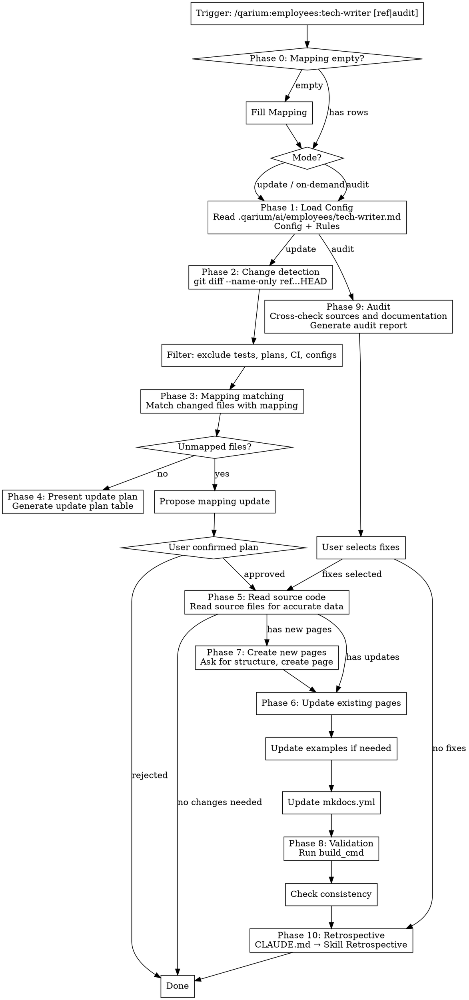

# Documentation Flow

## Overview

Documentation skill. Manages project documentation across three scenarios:

1. **Post-implementation updates** — after code changes and passing tests, analyze git diff, mapping changes to documentation using project configuration and rules, present an update plan for confirmation and validate with the build command.
2. **Proactive audit** — compare source code with existing documentation to find discrepancies (undocumented features, stale references, incorrect values).
3. **On-demand documentation** — create or update documentation for specific files, modules, or features upon user request.

## When to use

- After completing a feature with passing tests
- After a series of commits that add new CLI commands, API endpoints, configuration options, or other user-facing features
- When existing documentation is stale relative to the codebase
- When the user asks to verify documentation accuracy
- When the user asks to document a specific file, module, or feature



**DO NOT use when:**
- User explicitly asked to skip documentation
- There is no Mapping and the user does not want to create one

## Virtual Environment

Before executing any shell commands (mkdocs), detect the project's virtual environment:

1. Check for `.venv/` in the project root
2. If not found, check for `venv/`
3. If found → prefix all commands: `source .venv/bin/activate && <command>` (or `source venv/bin/activate && <command>`)
4. If not found → execute `<command>` as-is

This applies to Phase 8 (build_cmd).

## Phase 0: Fill Mapping

Before Phase 1, check the `### Mapping` section in `.qarium/ai/employees/tech-writer.md`:

1. If the mapping table **contains no data rows** (only the header `| Source path | Documentation files |`) — notify the user that the mapping is empty and offer to fill it now
2. If the mapping already contains rows — proceed to Phase 1

When filling the mapping:

1. Read the documentation structure from `docs/`
2. Scan the source directory for all source files (matching patterns from `[project.packages]` in pyproject.toml or standard conventions like `src/**/*.py`, `<name>/**/*.py`)
3. Scan `docs/` for all documentation pages
4. For each source file, determine its purpose. For small projects (< 50 files) — read each file. For large projects — first determine purpose by file and directory names, then only read files with ambiguous purpose
5. Determine which documentation pages it may affect, based on the file's purpose
6. Present a proposal table:

| Source path     | Documentation files                      |
|-----------------|------------------------------------------|
| `src/main.py`   | `docs/cli-reference.md`, `docs/index.md` |
| `src/config.py` | `docs/configuration.md`                  |

7. Ask the user to confirm or adjust the proposed mappings
8. After confirmation, write the rows to the Mapping table in `.qarium/ai/employees/tech-writer.md`

If the user declined to fill the mapping — proceed to Phase 1 with an empty mapping. Unmapped files will be handled in Phase 3.

## Phase 1: Load Configuration

Read `.qarium/ai/employees/tech-writer.md` and extract sections. All file content is written in English.

Read the **Lessons** section, if it exists. This section contains project-specific lessons learned during past sessions.

### Config

This section defines project-specific documentation settings. The format is a table:

```markdown
## Config

| Key           | Value                      | Description                        |
|---------------|----------------------------|------------------------------------|
| build_cmd     | `mkdocs build`             | Build validation command           |
| deploy_cmd    | `mkdocs gh-deploy --force` | Deploy command                     |
| examples_file | `docs/examples.md`         | File for usage examples (optional) |
| logo_url      | `https://avatars.githubusercontent.com/u/262344922?s=200&v=4` | Standard qarium logo |
```

All keys are optional. If a key is missing or empty, the skill uses a sensible default value or skips the corresponding behavior.

### Rules → Mapping

This section defines which source files correspond to which documentation pages:

```markdown
### Mapping

| Source path   | Documentation files                      |
|---------------|------------------------------------------|
| `src/main.py` | `docs/cli-reference.md`, `docs/index.md` |
| ...
```

### Rules → Conventions

This section contains documentation writing practices (tone, formatting). It may be empty. Conventions does NOT prescribe page structure — only writing style and formatting.

### Missing configuration

- If `.qarium/ai/employees/tech-writer.md` does not exist — notify the user and suggest running `qarium:employees:tech-writer:onboarding` first
- If Config is missing — continue with default settings: `build_cmd=mkdocs build`, no examples file
- If Mapping is missing — proceed to Phase 0 to fill it

## Phase 2: Change Detection

1. Determine the base reference for comparison:
   - If the skill is invoked with an argument — use it as the base reference (e.g., `origin/pr/42`, `v1.2`)
   - If no argument — determine `default_branch`:
     1. Read `base_branch` from `.qarium/ai/employees/tech-writer.md` Config
     2. If not found, read `default_branch` from `.qarium/ai/employees/lead.md` Config
     3. If not found, try `git symbolic-ref refs/remotes/origin/HEAD 2>/dev/null`
     4. If not resolved → `master` (fallback)
     5. Use the resolved branch name as the base reference
2. Run `git diff --name-only <base>...HEAD` to get changed files
3. If diff is empty, notify the user and stop
4. Exclude paths that do not affect documentation:
   - `tests/**` — test files
   - `docs/**` — documentation files (the skill updates documentation, it does not review existing changes)
   - `docs/plans/**` — design documents, not for end users
   - `.github/**`, `.gitlab-ci.yml`, `.circleci/**` — CI configuration
5. For project configuration files (e.g., `pyproject.toml`, `package.json`, `go.mod`) — check the diff content: include only if API options or dependencies changed, skip if only version numbers
6. Classify remaining files by change type using `git diff --diff-filter`:
   - **new** (`A`) — added file
   - **modified** (`M`) — modified file
   - **deleted** (`D`) — deleted file
   - **renamed** (`R`) — moved file (appears as deletion + addition)

**For deleted or renamed files** — find the old path in the mapping. If the old path maps to documentation, the documentation must be updated to remove references to the deleted entity.

### README.md

`README.md` is handled separately from the Mapping. Check for update needs when changes occur:

1. If `pyproject.toml` changed (name, description, dependencies) — check `README.md` for current description and "Installation" sections
2. If CLI commands, API endpoints, or core modules changed — check the "Quick Start" section for currency
3. If an update is needed — include `README.md` in the update plan (Phase 4) with specific sections noted

## Phase 3: Mapping Matching

For each filtered changed file, find it in the Mapping table from `.qarium/ai/employees/tech-writer.md`:

1. Glob pattern matching — `src/package/**/*.py` matches `src/package/module.py`
2. Collect all matched documentation files into a deduplicated list
3. Identify **unmapped files** — changed source files that do not match any mapping rule

### Unmapped files

If there are unmapped source files:

1. Read each unmapped file to understand its purpose (classes, functions, goal)
2. Determine which existing documentation pages it may affect
3. Present a proposal to the user:

| Unmapped file        | Proposed documentation  | Reason                             |
|----------------------|-------------------------|------------------------------------|
| `src/new_feature.py` | `docs/configuration.md` | Contains new configuration options |

4. Ask the user to confirm or adjust the proposed mappings
5. On confirmation — **update `.qarium/ai/employees/tech-writer.md`** by adding new rows to the Mapping table
6. After adding new entries, run **Summary and optimization** of the `### Mapping` section (see rules below)

This keeps the mapping in sync with project evolution.

### Summary and optimization

After any update to the `### Mapping` section, analyze and optimize it:

**Merge overlaps** — if multiple entries map to the same documentation files and can be expressed with a single glob pattern, merge them. Keep the most general pattern that correctly describes the mapping.

**Remove stale entries** — entries referencing source files or documentation pages that no longer exist. Verify by searching both directories.

**Remove duplicate target documentation pages** — if a documentation page appears in multiple mapping rows but only one source file actually contributes, remove the extra entries. Verify by reading the documentation page.

**Size limit** — after optimization, the `### Mapping` section must be **the same size or smaller** than before updates. If it grew — continue optimizing. Exception: if the section has fewer than 10 rows, skip optimization — too small.

## Phase 4: Present Update Plan

Generate a plan table and present it to the user for confirmation:

| Action  | File                    | What to update                                               |
|---------|-------------------------|--------------------------------------------------------------|
| update  | `docs/metrics.md`       | Add new metric `foo` to Quick Reference and detailed section |
| update  | `docs/index.md`         | Add new command to the command list                          |
| create  | `docs/baz.md`           | New page for baz language support                            |
| remove  | `docs/cli-reference.md` | Remove deleted `--old-flag` from the options table           |

Wait for confirmation, modification, or rejection of the plan. Continue only with approved items.

## Phase 5: Read Source Code

Before making documentation changes, read source files to extract accurate data:

- **CLI changes** — read sources for command names, arguments, types, default values, help texts
- **API changes** — read sources for endpoint paths, methods, parameters, response schemas
- **Metrics/configuration changes** — read sources for names, types, default values, descriptions, formulas
- **Report structure changes** — read sources for fields, types, hierarchy
- **Any other changes** — read sources to understand what was added, changed, or deleted

**All values in documentation must come from source code — never guess or invent values.**

## Phase 6: Update Existing Pages

Strictly follow the existing documentation style.

### Determine update scope

First read the changed documentation file, then determine what needs to be updated:

| Change type                         | Scope                                  | Example                                |
|-------------------------------------|----------------------------------------|----------------------------------------|
| New value for existing option       | One table row                          | New default value for `--top-packages` |
| New option/field                    | New table row + description            | New option `--format csv`              |
| New command/subcommand              | New section with options table         | New command `myapp compare`            |
| New metric or configuration element | Quick Reference row + detailed section | New metric "Coupling"                  |
| Changed formula/logic               | Updated text in existing section       | Score formula changed                  |
| Deleted entity                      | Remove row/section                     | Flag `--verbose` deleted               |

Apply the minimal change that accurately reflects the code change. Do not rewrite sections unaffected by the changes.

### Formatting

- **Tables** — pipe-separated with header separator: `| Column | Description |`
- **Code blocks** — always with language specifier: ` ```bash`, ` ```python`, ` ```yaml`
- **Headings** — `#` for page title, `##` for main sections, `###` for subsections
- **Bold** — for highlighting key terms: `**Important concept**`
- **Inline code** — for commands, options, file paths: `` `--option-name` ``
- **Tone** — follow Conventions from configuration. If Conventions is empty, default: second person ("you"), concise, instructive

### Update Patterns

1. **Adding a metric or configuration element** — add a row to the Quick Reference table (if the page has one), add a detailed section with description, parameters, and at least one example
2. **Adding a CLI/API option** — add a row to the options table with columns `Option`, `Default`, `Description`
3. **Adding a command/endpoint** — add a new section with arguments, options, and usage examples
4. **Adding an example** — if `examples_file` is configured, add to that file in Context/Command/Workflow format; otherwise add to the most relevant page from the mapping
5. **Removing a deleted entity** — find all references (table rows, code examples, text mentions) and remove them. Do not leave placeholders unless the source code marks it as deprecated (not deleted).
6. **Updating report/data fields** — add/remove rows in Field/Type/Description format on the relevant page from the mapping
7. **Updating index/summary pages** — pages with summary tables and lists need their summary sections updated
8. **Updating README.md** — update only affected sections: description when pyproject.toml changes, "Quick Start" when CLI/API changes, "Installation" when dependencies change. Do not touch other README.md sections.

### Rules

- Exactly match the formatting of surrounding content
- Do not refactor or reformat existing content
- Place new elements in a logical position (alphabetically, in code order, or after related elements)
- If `examples_file` is configured, use `---` separators between unrelated examples

### When to add examples

After updating existing pages, check whether changes require a new example:

- New CLI command or API endpoint → new workflow example
- New feature requiring configuration → new setup example
- Changed output format → updated command example

Add examples only if `examples_file` is configured or if the page from the mapping contains an Examples section.

## Phase 7: Create New Pages

When the plan includes creating a new page:

### Determine page structure

When creating a page **from scratch** — ask the user what structure they want. Suggest options based on page type:

| Page type       | Suggested structure                                                         |
|-----------------|-----------------------------------------------------------------------------|
| Metrics         | Heading → Quick Reference (table) → Detailed sections per metric → Examples |
| CLI commands    | Heading → Options table → Usage examples                                    |
| API endpoints   | Heading → Quick Reference → Detailed sections per endpoint → Examples       |
| Configuration   | Heading → Parameters table → Configuration examples                         |
| Getting started | Heading → Installation → Quick start → Examples                             |
| Concepts        | Heading → Description → Examples                                            |

The user selects an option or proposes their own structure. Create the page according to the approved structure.

### When updating a stub page

If the target page exists but contains only a heading (a stub page created during onboarding) — treat this as creating from scratch and ask the user about the page structure.

### When updating an existing page with content

If the target page contains real content (not a stub) — follow the existing page structure. Do not ask the user.

### Navigation update

After creating a new page, update `mkdocs.yml`:

1. Read the current `nav` section in `mkdocs.yml`
2. Add the new page in the appropriate position
3. Follow the existing order and format

## Phase 8: Validation

Run the validation sequence:

1. Run `build_cmd` from Config — verify that documentation builds without errors
   - On build error — fix and rerun
   - If after 2 iterations the build still fails — explain the remaining problem and wait for user instructions
2. Check all changed documentation files for consistency with source code (always performed)
3. **Conventions update** — if documentation updates in this session revealed a consistent style choice not yet in Conventions, present it to the user:

   **Signals to look for:**
   - A formatting choice was made that differs from the default style
   - A specific heading structure, list style, or table format was consistently applied
   - The user corrected a style choice during review

   **Significance filter:**

   **Suggest if:**
   - The convention would prevent a style inconsistency in a future session
   - The convention is specific to this project (not universal writing advice)
   - An AI agent would make a different style choice without this knowledge

   **Skip if:**
   - The convention is already captured in the existing Conventions list
   - The convention is a universal best practice
   - The convention was applied only once and may not recur

   If the user approves — add to `### Conventions` in `.qarium/ai/employees/tech-writer.md`. Follow the same optimization rules as Mapping (merge duplicates, remove stale, size limit).
4. **Config updates** — check if Config values still match the actual project state. Do not add or remove Config keys.

   | Check                                           | Source                                                          | Action                                       |
   |-------------------------------------------------|-----------------------------------------------------------------|----------------------------------------------|
   | `base_branch` matches the actual default branch | Read `default_branch` from lead.md Config or `git symbolic-ref` | If differs — update `base_branch` in Config  |
   | `build_cmd` works                               | Already verified in step 1                                      | If it failed — suggest updating the command  |

   Present Config updates alongside Conventions updates. Wait for user approval.

## Phase 9: Audit (proactive mode)

Used when the user asks to check documentation for stale data or verify code-documentation synchronization — without a specific git diff. This phase replaces Phases 2-4.

### How to conduct an audit

1. Read the Mapping from `.qarium/ai/employees/tech-writer.md` to determine which source files correspond to which documentation pages
2. Scan the source directory for all source files:
   - List all files matching project patterns (e.g., `<source>/**/*.py`)
   - Exclude internal/utility files explicitly mapped to `—`
3. For each source file pattern in the mapping:
   - Expand glob patterns into actual files
   - Read each source file and extract the public API: functions, classes, commands, options, configuration keys, endpoints
4. Identify **unmapped source files** — source files that exist but do not match any mapping rule:
   - Compare the full list of source files with the mapped patterns
   - For each unmapped file, read it and determine which existing documentation pages it may affect
   - Include in the audit report with status **unmapped**
5. For each mapped documentation page:
   - Read the documentation page
   - Cross-check documented entities against actual source code
6. Generate the audit report:

| Source file           | Doc page                | Status       | Details                                                                  |
|-----------------------|-------------------------|--------------|--------------------------------------------------------------------------|
| `src/cli.py`          | `docs/cli-reference.md` | **stale**    | Option `--verbose` removed from sources, but still in documentation      |
| `src/api.py`          | `docs/api.md`           | **missing**  | Endpoint `POST /items` not documented                                    |
| `src/config.py`       | `docs/configuration.md` | **ok**       | All configuration options documented                                     |
| `src/new_feature.py`  | —                       | **unmapped** | No mapping rule; contains 3 public functions that may need documentation |

### Status values

- **ok** — documentation matches the source code
- **stale** — documentation references something that no longer exists in the sources
- **missing** — something in the sources is not covered by documentation
- **inaccurate** — documented value differs from the actual value (incorrect default, wrong type, etc.)
- **unmapped** — source file exists but has no mapping rule; impact on documentation is unknown

### After audit

1. Present the audit report to the user
2. Ask which issues to fix
3. For approved fixes — follow Phases 5-8 (read sources, update pages, validation)
4. For unmapped source files — follow the Unmapped files process from Phase 3 to propose and confirm new mapping rules before updating documentation (including Summary and optimization)

### README.md audit

In addition to the Mapping audit, check `README.md`:

1. Read `README.md` and `pyproject.toml`
2. Verify the project description against `[project.description]`
3. Verify the "Installation" section against `[project.name]` and `[project.dependencies]`
4. Verify the "Quick Start" section against current CLI commands or API endpoints
5. Include results in the overall audit report

### Theme configuration audit

Check the integrity of the custom MkDocs Material theme:

1. **`mkdocs.yml`** — verify that the `theme` section contains:
   - `custom_dir: docs/overrides` — path to overrides
   - `primary: custom` — custom palette in both schemes (default and slate)
   - `logo:` — standard qarium logo (`https://avatars.githubusercontent.com/u/262344922?s=200&v=4`)
2. **`docs/overrides/main.html`** — verify that the file exists and contains:
   - `` — inheritance from the base template
   - `extrahead` block with palette CSS variables (`--md-primary-fg-color: #0a0a13`, `--md-primary-bg-color: #ffffff`)
   - Styles for `.md-search__form`, `.md-search__inner`, `.md-search__overlay` — search bar customization
   - Styles for `.md-header__button.md-logo` — rounded 32px logo
   - Styles for `[data-md-color-scheme=slate] .md-nav__link`, `.md-toc__link`, `article a` — readable links in dark theme
3. If files are missing or corrupted — include in the audit report with status **missing** or **stale**

### Conventions audit

Check whether existing Conventions are still followed in the documentation:

1. Read `### Conventions` from `.qarium/ai/employees/tech-writer.md`
2. If Conventions is empty — include in the audit report with status **missing**
3. For each convention, scan `docs/` for evidence:
   - `stale` — convention describes a style pattern no longer used (e.g., "use first person" but docs use second person)
   - `ok` — convention is followed in documentation

## Common mistakes

| Mistake                                                                  | Fix                                                                                       |
|--------------------------------------------------------------------------|-------------------------------------------------------------------------------------------|
| Inventing values, thresholds, or default values                          | Always read from source code                                                              |
| Changing the style of existing content                                   | Exactly match the surrounding format                                                      |
| Forgetting to update navigation in mkdocs.yml                            | Always update `nav` in mkdocs.yml when creating new pages                                 |
| Adding examples without context                                          | Use Context/Command/Workflow format                                                       |
| Refactoring existing documentation                                       | Update only what changed, leave the rest untouched                                        |
| Guessing default values for CLI options                                  | Read from source code or run `--help`                                                     |
| Skipping build validation                                                | Always run build_cmd                                                                      |
| Creating unnecessary pages                                               | Create pages only for major new features                                                  |
| Ignoring deleted files                                                   | Deleted sources → remove references from documentation                                    |
| Reading configuration from CLAUDE.md                                     | Read configuration only from `.qarium/ai/employees/tech-writer.md`                        |
| Not updating mapping for unmapped files                                  | Always propose mapping updates for new source files                                       |
| Assuming documentation defaults                                          | First read Config from `.qarium/ai/employees/tech-writer.md`                              |
| Skipping audit when documentation is stale                               | Run Phase 9 for systematic code-documentation discrepancy detection                       |
| Skipping Summary and optimization after mapping update                   | Mapping will grow indefinitely                                                            |
| Removing mapping entries without checking source/documentation existence | Check both directories before removing entries                                            |
| Skipping Phase 0 when mapping is empty                                   | Always check mapping before proceeding to Phase 1                                         |
| Creating a page from scratch without asking about structure              | Always ask the user when creating a page from scratch                                     |
| Forgetting to check README.md during audit                               | Always check README.md separately from the Mapping audit                                  |
| Skipping `docs/overrides/main.html` audit                                | Always check theme overrides integrity                                                    |
| Deleting or overwriting `docs/overrides/main.html` during updates        | Do not touch overrides when updating documentation                                        |
| Using hardcoded `main` as default base reference                         | Always determine from tech-writer.md Config, lead.md Config, or git; fallback to `master` |
| Running `mkdocs` without virtualenv activation                           | Always check for `.venv/` or `venv/` and use `source <venv>/bin/activate && <command>`    |
| Never updating Conventions after documentation work                      | Always check for new conventions after Phase 8 validation and suggest them to the user    |
| Never refreshing tech-writer.md Config after branch changes              | Always check `base_branch` against the actual default branch during Phase 8 validation    |
| Skipping Conventions audit                                               | Always check that existing Conventions are still followed in docs during Phase 9 audit    |

## Phase 10: Retrospective

After completing all main work, perform the retrospective as defined in CLAUDE.md → Skill Retrospective.
