# Tech Writer Onboarding

## Overview

Setting up project documentation infrastructure from scratch.
Analyzes the Python project, proposes documentation structure based on source code, creates MkDocs structure, and records configuration in `.qarium/ai/employees/tech-writer.md` for future sessions.

MkDocs is the only static site generator. No choice is offered.

## When to use

- The project has no `docs/` directory or it contains no `.md`/`.rst` files
- There is no `.qarium/ai/employees/tech-writer.md` file
- The `/qarium:employees:tech-writer` dispatch routes here automatically

**DO NOT use when:**
- The project already has documentation with content and `.qarium/ai/employees/tech-writer.md` exists — use `qarium:employees:tech-writer:feature`
- This is not a Python project
- `.qarium/ai/employees/tech-writer.md` already exists — warn the user and suggest using `qarium:employees:tech-writer:feature`

## Virtual Environment

Before executing any shell commands (pip, python, mkdocs), detect the project's virtual environment:

1. Check for `.venv/` in the project root
2. If not found, check for `venv/`
3. If found → prefix all commands: `source .venv/bin/activate && <command>` (or `source venv/bin/activate && <command>`)
4. If not found → execute `<command>` as-is

This applies to Phase 5 (pip install, mkdocs build).

```dot
digraph flow {
    rankdir=LR;
    analyze [label="Phase 1: Project analysis\ntype, dependencies, Python version, source structure" shape=box];
    structure [label="Phase 2: Structure proposal\nsource analysis → pages" shape=box];
    config [label="Phase 3: Configuration\nbuild_cmd, deploy_cmd, examples_file" shape=box];
    create [label="Phase 4: Structure creation\nmkdocs.yml, docs/, nav" shape=box];
    install [label="Phase 5: Installation and verification\npip install, build_cmd" shape=box];
    rules [label="Phase 6: Write .qarium/ai/employees/tech-writer.md\nConfig + Rules" shape=box];
    retro [label="Phase 7: Retrospective\nCLAUDE.md → Skill Retrospective" shape=box];
    done [label="Done" shape=box];

    analyze -> structure;
    structure -> config;
    config -> create;
    create -> install;
    install -> rules;
    rules -> retro;
    retro -> done;
}
```



## Phase 1: Project Analysis

Collecting information about the current state of the project.

1. **Project type** — read `pyproject.toml` and classify:
   - **Library** — contains `[project]` without `scripts` or `[project.scripts]` is empty
   - **CLI application** — contains `[project.scripts]` or uses click/typer
   - **Web application** — depends on fastapi, django, flask
2. **Python version** — read `requires-python` from `[project]` in `pyproject.toml`. Extract the minimum version (e.g., `>=3.10` → `py310`). If not specified, default to `py312`.
3. **Existing documentation** — check `docs/`, `mkdocs.yml`
4. **Existing README** — check `README.md`: does not exist, standard git template, or full content
5. **Existing dependencies** — check `[project.dependencies]` and `[project.optional-dependencies]` in `pyproject.toml` for documentation tools (mkdocs, mkdocs-material, etc.)
6. **Dependency group name** — check `[project.optional-dependencies]` for existing groups with documentation tools. Remember the group name (e.g., `docs`). If nothing is found, default to `docs`.
7. **Source structure** — scan the source directory to understand modules, CLI commands, configuration, API. This information is used in Phase 2 for proposing documentation structure.
8. **.gitignore** — check if `docs/plans/` is in `.gitignore`
9. **GitHub repository** — extract the organization/user from the URL in `pyproject.toml [project.urls]` or from `git remote`. Used to form the default logo URL: `https://avatars.githubusercontent.com/u/<org_or_user_id>?s=200&v=4`. If the repository is not on GitHub — leave the logo empty.

Present a summary to the user before proceeding to Phase 2.

### Existing documentation without configuration

If `docs/` contains `.md` or `.rst` files but `.qarium/ai/employees/tech-writer.md` is missing, inform the user that documentation already exists. Ask whether to:

1. **Configure for existing documentation** — create a configuration pointing to the existing `docs/` structure, skip creating docs/ files in Phase 4, offer to supplement navigation with missing pages. README.md should be checked and created/overwritten according to the README.md section rules in Phase 4.
2. **Start fresh** — go through all phases and create a new documentation structure (existing docs/ files will not be overwritten per Phase 4 rules; README.md is an exception)

## Phase 2: Documentation Structure Proposal

Based on the project analysis from Phase 1, propose a list of documentation pages.

### Base pages by project type

| Project type    | Base pages                                           |
|-----------------|------------------------------------------------------|
| CLI application | `index.md`, `getting-started.md`, `cli-reference.md` |
| Library         | `index.md`, `getting-started.md`, `api-reference.md` |
| Web application | `index.md`, `getting-started.md`, `api-reference.md` |
| Any             | `configuration.md`, `examples.md`                    |

### Additional pages from source analysis

Based on the source structure from Phase 1, propose additional pages:

| Found in sources                       | Proposed page      |
|----------------------------------------|--------------------|
| Multiple CLI commands with subcommands | `cli-reference.md` |
| Configuration modules                  | `configuration.md` |
| Modules with metrics/calculations      | `metrics.md`       |
| API endpoints                          | `api-reference.md` |
| Plugins/extensions                     | `plugins.md`       |

The user confirms, adds, or removes pages. The approved list forms the navigation in `mkdocs.yml`.

Present the full navigation structure and request confirmation before Phase 3.

## Phase 3: Configuration

Ask the user to confirm or adjust documentation settings.

### Questions (one at a time)

| # | Setting         | Default                    | Notes                        |
|---|-----------------|----------------------------|------------------------------|
| 1 | `build_cmd`     | `mkdocs build`             | Build validation command     |
| 2 | `deploy_cmd`    | `mkdocs gh-deploy --force` | Documentation deploy command |
| 3 | `examples_file` | none (optional)            | File for usage examples      |
| 4 | `logo_url`      | GitHub avatar from Phase 1 | Header logo URL (optional)   |
| 5 | `base_branch`   | auto (from lead.md or git) | Base branch for git diff comparison |

> **`base_branch` determination algorithm:**
> 1. Read `default_branch` from `.qarium/ai/employees/lead.md` Config
> 2. If `lead.md` does not exist → try `git symbolic-ref refs/remotes/origin/HEAD 2>/dev/null`
> 3. If not resolved → `master` (fallback)

After all choices, present the full configuration summary and request confirmation before Phase 4.

## Phase 4: Structure Creation

Create documentation files based on the approved choices.

### MkDocs

Create `mkdocs.yml` (if it does not exist):
```yaml
docs_dir: docs

site_name: <from pyproject.toml [project.name]>
site_description: <from pyproject.toml [project.description]>
site_url: <from pyproject.toml [project.urls.Homepage] or leave empty>
repo_url: <from git remote or pyproject.toml>
edit_uri: edit/<default_branch>/docs/

theme:
  name: material
  custom_dir: docs/overrides
  logo: <from Phase 3, logo_url>
  palette:
    - scheme: default
      primary: custom
      accent: indigo
      toggle:
        icon: material/brightness-7
        name: Switch to dark mode
        media: "(prefers-color-scheme: light)"
    - scheme: slate
      primary: custom
      accent: indigo
      toggle:
        icon: material/brightness-4
        name: Switch to light mode
        media: "(prefers-color-scheme: dark)"
  features:
    - navigation.tabs
    - navigation.indexes
    - search.suggest
    - search.highlight
    - content.code.copy

nav:
  - Home: index.md
  - Getting Started: getting-started.md
  ...
```

If `logo_url` is not specified — skip the `logo:` line. Navigation is formed from the approved page list from Phase 2.

### Theme overrides

Create `docs/overrides/main.html` (if it does not exist):
```html



  {{ super() }}
  <style>
    /* Dark navbar — override palette in both themes */
    [data-md-color-scheme=default][data-md-color-primary=custom],
    [data-md-color-scheme=slate][data-md-color-primary=custom] {
      --md-primary-fg-color: #0a0a13;
      --md-primary-fg-color--light: #0a0a13cc;
      --md-primary-bg-color: #ffffff;
    }

    .md-header__button.md-logo img,
    .md-header__button.md-logo svg {
      width: 32px;
      height: 32px;
      border-radius: 50%;
    }

    /* Search form — visible on dark header */
    .md-search__overlay {
      background-color: transparent !important;
    }
    [data-md-toggle=search]:checked~.md-header .md-search__overlay {
      background-color: #0000008a !important;
    }
    .md-search__inner {
      background-color: transparent !important;
    }
    .md-search__form {
      background-color: #3a3a3a !important;
      border-radius: 0.5rem;
    }
    .md-search__form:hover {
      background-color: #4a4a4a !important;
    }
    .md-search__input {
      color: #e0e0e0 !important;
    }
    .md-search__input::placeholder {
      color: #999999 !important;
    }
    .md-search__icon {
      color: #999999 !important;
    }
    .md-search__form:hover .md-search__icon,
    .md-search__input:focus-visible ~ .md-search__icon {
      color: #e0e0e0 !important;
    }

    /* Links in dark theme — readable on dark background */
    [data-md-color-scheme=slate] .md-nav__link,
    [data-md-color-scheme=slate] .md-toc__link,
    [data-md-color-scheme=slate] article a {
      color: #cbd5e0 !important;
    }
    [data-md-color-scheme=slate] .md-nav__link--passed,
    [data-md-color-scheme=slate] .md-toc__link--passed {
      color: #718096 !important;
    }
    [data-md-color-scheme=slate] .md-nav__link:hover,
    [data-md-color-scheme=slate] .md-toc__link:hover,
    [data-md-color-scheme=slate] article a:hover {
      color: var(--md-accent-fg-color) !important;
    }
  </style>

```

Create the `docs/overrides/` directory if it does not exist.

Create all approved pages as stub files with a heading — the page name.

### README.md

Create or overwrite `README.md`:

- **Does not exist** — create from template
- **Standard git template** (minimal content, no project description) — overwrite from template
- **Full content** (project description, sections) — skip, do not overwrite

`README.md` template:

```markdown
# <project name from pyproject.toml>

<description from pyproject.toml>

## Installation

\```bash
pip install <project name>
\```

## Quick Start

[Brief usage example based on project type and Phase 1 source analysis]

## Documentation

Full documentation is available at [link to site_url from pyproject.toml or ./docs/]
```

The template is in English. The "Installation" section and description are filled from `pyproject.toml`. The "Quick Start" section is filled based on the source analysis from Phase 1 (CLI command, basic library usage example, etc.).

### Rules

- Create `docs/` if it does not exist
- Do not overwrite existing files — skip if already present (README.md is an exception, see the README.md section above)
- Add `docs/plans/` to `.gitignore` (append to the end if `.gitignore` exists; create `.gitignore` if it does not)
- `index.md` — the first page in navigation with the project name and description from pyproject.toml

## Phase 5: Installation and Verification

1. Add documentation dependencies to pyproject.toml under the dependency group name determined in Phase 1 (e.g., `docs`). If the group already exists, add to it.
   - Minimum set: `mkdocs`, `mkdocs-material`
2. Install dependencies via pip:
   ```
   pip install -e ".[docs]"
   ```
   If virtualenv was detected (see Virtual Environment), prefix with `source .venv/bin/activate &&`. If not, run as-is.
3. Run `build_cmd` to verify successful documentation build.

**On build error:**
- Fix the issue
- Re-run `build_cmd`
- If after 2 iterations the build still fails — explain and wait for user instructions

## Phase 6: Write `.qarium/ai/employees/tech-writer.md`

Create the tech writer configuration file. The file is written in English.

### File structure

```markdown
# Tech Writer Config

## Config

| Key           | Value                      | Description                        |
|---------------|----------------------------|------------------------------------|
| build_cmd     | `mkdocs build`             | Build validation command           |
| deploy_cmd    | `mkdocs gh-deploy --force` | Deploy command                     |
| examples_file | `docs/examples.md`         | File for usage examples (optional) |
| logo_url      | `https://...`              | Header logo URL (optional)         |
| base_branch   | `master`                   | Base branch for git diff comparison |

## Rules

### Mapping

| Source path | Documentation files |
|-------------|---------------------|

### Conventions

## Lessons

| Problem | Why | How to prevent |
|---------|-----|----------------|
```

- Fill in Config values from the user's choices in Phase 3
- If `examples_file` is left as optional — use an empty value in the table
- If `logo_url` is left as optional — use an empty value in the table
- Mapping — empty template (table header only), will be filled in subsequent flow calls
- Conventions — empty placeholder for future expansion

### Rules

1. Create the `.qarium/ai/employees/` directory if it does not exist
2. If `.qarium/ai/employees/tech-writer.md` already exists — DO NOT overwrite. Explain to the user and suggest using `qarium:employees:tech-writer:feature`
3. Present the generated file for user approval before writing
4. After writing, verify the file correctness by reading it back

## Common mistakes

| Mistake                                                         | Fix                                                                      |
|-----------------------------------------------------------------|--------------------------------------------------------------------------|
| Overwriting existing mkdocs.yml                                 | Check before creating — only create missing files                        |
| Overwriting existing `.qarium/ai/employees/tech-writer.md`      | Check first, on discovery suggest `qarium:employees:tech-writer:feature` |
| Skipping dependency installation                                | Always run `pip install -e ".[docs]"` after Phase 4                      |
| Skipping build verification                                     | Always verify that build_cmd works                                       |
| Writing configuration without user approval                     | Present for review first                                                 |
| Failing to detect existing dependencies                         | Carefully review Phase 1 results before asking questions                 |
| Using default table values when Phase 1 detected existing tools | Phase 1 analysis takes priority over default values                      |
| Not adding the dependency group `[docs]` to pyproject.toml      | Always add documentation dependencies to pyproject.toml                  |
| Forgetting to add `docs/plans/` to `.gitignore`                 | Check in Phase 1 and add in Phase 4                                      |
| Overwriting a full README.md                                    | Check README.md content — only overwrite if it is a git template         |
| Skipping creation of `docs/overrides/main.html`                 | Always create alongside mkdocs.yml in Phase 4                            |
| Forgetting `custom_dir` and `primary: custom` in mkdocs.yml     | The mkdocs.yml template in Phase 4 contains these settings               |
| Running `pip`/`mkdocs` without virtualenv activation            | Always check for `.venv/` or `venv/` and use `source <venv>/bin/activate && <command>` |
| Hardcoding `main` as base branch in Config                      | Always determine from lead.md or git; fallback to `master`               |

## Phase 7: Retrospective

After completing all main work, perform the retrospective as defined in CLAUDE.md → Skill Retrospective.
